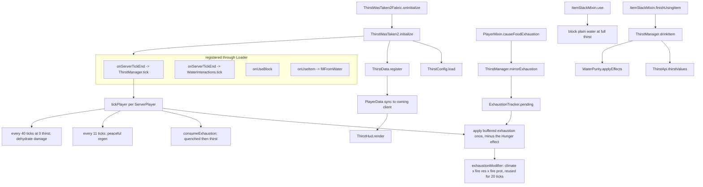

# ThirstWasTaken2

A fork of [Thirst Was Taken](https://github.com/ghen-git/Thirst-Mod) (originally Forge,
Minecraft 1.19.2) for **Minecraft 26.2, 26.1.x, 1.21.11 and 1.21.1** on both **Fabric Loader 0.19.5**
and **NeoForge** (26.2.0.88, 26.1.2.109, 21.11.45 and 21.1.250). It adds a
survival thirst bar, drinking, and water purity to Minecraft and further extends the original mod. It
started as a port and has since diverged, so upstream is a reference, not a spec.

- Mod id and resource namespace: `thirstwastaken2`
- Java package: `com.thirstwastaken2`
- Upstream reference source is expected at `../Thirst-Mod` when comparing behaviour.
- Published on [Modrinth](https://modrinth.com/mod/thirst-was-taken-2).

## Build and run

One source tree produces one jar per Minecraft version. Every version is a Gradle subproject named
after its entry in `settings.gradle.kts`: `26.2.x`, `26.1.x`, `1.21.11`, `1.21.1` on Fabric, and the
same four with a `-neoforge` suffix on NeoForge, with a buildscript of their own
(`build.neoforge.gradle.kts`). The Fabric `1.21.1` jar also covers 1.21, which nothing the
mod touches differs from; the NeoForge one does not, because 1.21 is a separate NeoForge generation.

Build every version and collect the jars in `build/libs/`:

```bash
./gradlew buildAndCollect
```

Build or run one version:

```bash
./gradlew ":26.1.x:build"
```

```bash
./gradlew ":26.1.x:runServer"
```

```bash
./gradlew ":26.1.x:runClient"
```

The `-neoforge` nodes have two more clients, `runManualA` and `runManualB`, named `TesterA` and
`TesterB` with a game directory each. They exist for the checklist items that need two players on one
`runServer`; see [docs/dev/MANUAL-TESTING.md](docs/dev/MANUAL-TESTING.md).

Run the automated in-game tests for one version:

```bash
./gradlew ":26.1.x:runGametest"
```

That is the check that actually proves behaviour. It replaces the dedicated server with Mojang's
GameTest runner, needs no display and no accepted EULA, finishes in a few seconds, and fails the
build on a failed assertion. CI runs it for every node, the `-neoforge` ones included. See
[src/gametest/java/AGENTS.md](src/gametest/java/AGENTS.md) before adding to it, including what it
deliberately does not cover.

Regenerate every datapack and asset JSON the mod ships:

```bash
./gradlew ":26.1.x:runDatagen"
```

Recipes, advancements, tags, the damage type and the item models are all written by `src/datagen`
into `src/main/generated/<minecraft version>/`, never edited by hand. `":<version>:checkDatagen"`
regenerates and then fails if the result differs from what is committed; CI runs it for every
version. See [src/datagen/java/AGENTS.md](src/datagen/java/AGENTS.md), including why the versions
produce different bytes from one body of code. Datagen runs on Fabric only; a NeoForge node reads
the output for its Minecraft version and translates its Fabric-only JSON keys as it copies them, and
`:<node>-neoforge:checkNeoForgeResources` fails if one survives.

Measure what the mod costs a server, in time and memory, without anyone joining:

```bash
./gradlew ":26.2.x:runBenchmark"
```

It starts the dedicated server with the dev tools, runs `/thirst benchmark` from the console once the
server is up, simulates 1 to 200 players plus every interaction, writes
`run/<version>/benchmark/latest.json` and stops the server again. `-Pbenchmark=quick`, `stress` or
`"players 500 1200"` changes the scale. The same command works typed into a `runServer` console. Read
[src/dev/java/AGENTS.md](src/dev/java/AGENTS.md) before comparing two reports.

`runServer` is the fastest smoke test: it applies every mixin, loads the datapack registries, then
idles. A clean run prints `ThirstWasTaken2 initialized for Minecraft <version>` and no exceptions.
Each version gets its own `run/<subproject>/` directory, because a world saved by one Minecraft
version is not readable by another.

Unqualified `./gradlew build` and `./gradlew runServer` still work; they act on the **active**
version, which is whichever one the source tree is currently checked out for (`26.2.x` by default).
Switch it with `./gradlew "Set active project to 1.21.11"` — that rewrites the versioned comments in
`src/` in place, which is what makes the IDE resolve against that version. Run
`./gradlew "Reset active project"` before committing.

Gradle needs network access on the first run for `maven.modrinth` artifacts (Mod Menu, AppleSkin,
Cloth Config, Jade, Farmer's Delight Refabricated, and Create Fly on the nodes that set it).
Once cached, `--offline` works — except that the client compile-only dependencies must already be
cached.

## Stack and constraints

- **Minecraft 26.2, 26.1.x, 1.21.11 and 1.21.1**, **Fabric Loader 0.19.5**, **Fabric Loom 1.17**. 26.1+
  runs on **Java 25**, 1.21.x on **Java 21**; the build sets the toolchain and `--release` per version,
  so do not use a language feature newer than Java 21.
- **Multi-version via [Stonecutter](https://stonecutter.kikugie.dev)**. `settings.gradle.kts` lists
  the versions, `stonecutter.properties.toml` holds every per-version value (dependency versions,
  the `fabric.mod.json` range), `stonecutter.gradle.kts` is the controller, and `build.gradle.kts`
  is shared by the Fabric nodes. `dev.kikugie.loom-back-compat` picks the Loom variant each version
  needs — 26.1 dropped obfuscation — and keeps `modImplementation` meaning the same thing on both.
  The NeoForge nodes use ModDevGradle through `build.neoforge.gradle.kts`; what both scripts need is
  in `gradle/shared.gradle.kts`.
- **Gradle Kotlin DSL**. There is no version catalog: per-version values cannot live in one, so
  they are all in `stonecutter.properties.toml`.
- **Source sets are split** (`loom.splitEnvironmentSourceSets()`). Anything that touches
  `net.minecraft.client` belongs in `src/client/java`, never in `src/main/java`. ModDevGradle has no
  split, so the NeoForge nodes compile both into one; the four Fabric nodes still catch a mistake.
- **`ThirstWasTaken2.DEV` separates development runs from published jars.** It is true under every
  Loom run task and false in the jar players install; `-Dthirstwastaken2.dev=true|false` overrides it.
  Dev-only tooling checks it before registering anything and lives in the `dev` source set, its own
  `thirstwastaken2-dev` mod like the gametests, which `main` and `client` never reference.
- **Mixins live in `com.thirstwastaken2.mixin`**, are package-private, `abstract`, and prefix every
  injected member with `thirst$`. New mixins must be listed in `thirstwastaken2.mixins.json`. The
  exceptions have configs of their own: client mixins in
  `src/client/resources/thirstwastaken2.client.mixins.json`, Fabric-only client mixins in
  `src/client/fabric/resources/thirstwastaken2.fabric.client.mixins.json`, and the Create Fly mixins in
  `src/main/createfly/resources/thirstwastaken2.createfly.mixins.json`. A new config goes in both
  manifests.
- **Config is a plain POJO** serialized by Gson (`ThirstConfig`). Adding a field means: add it to the
  POJO, clamp it in `sanitize()`, and — if it is user-facing — add a widget and a reset line to its
  page in `client/config/ConfigCategory` plus `en_us`/`vi_vn` keys.
- **Per-item lookups are cached** keyed by `Item` identity (`ThirstApi.CACHE`, `WaterPurity.INFO`).
  Never do registry-name string building or regex compilation on a per-call path; the tooltip
  renderer calls into both once per frame.
- **Optional mod integrations are soft**. Never add a hard dependency: gate on
  `Loader.isModLoaded`, plus a marker-class probe when the integration extends a foreign class,
  and keep integration classes out of the load path otherwise.
- **`src/main/java` and `src/client/java` never name a mod loader.** Loader calls go through
  `platform/Loader` and `client/platform/ClientLoader`, one copy per loader in `src/main/<loader>`
  and `src/client/<loader>`; `checkLoaderSeam` fails the build otherwise. See
  [platform/AGENTS.md](src/main/java/com/thirstwastaken2/platform/AGENTS.md).
- Player thirst state is an **immutable record** (`ThirstData`) stored through `Loader.playerData`. Mutate
  by deriving a new record and calling `ThirstManager.set`; only write when the value actually
  changed, because every write costs a sync packet.

## Supporting several Minecraft versions

The rule is that version differences stay in two places and nowhere else. Mod loader differences
have a place of their own, `platform/Loader`, and the two never meet in one file; see
[platform/AGENTS.md](src/main/java/com/thirstwastaken2/platform/AGENTS.md).

**`platform/`** — `com.thirstwastaken2.platform.Vanilla` for common code and
`com.thirstwastaken2.client.platform.ClientVanilla` for client code. Each is a thin wrapper over a
vanilla call whose shape moved between versions, with the same signature on every version. Callers
never learn which branch is live. Both have their own `AGENTS.md`.

**`mixin/`** — an `@Inject` signature tracks its target method and cannot be abstracted away, so a
mixin is allowed to fork. Its body still stays one line; the logic it calls lives in a normal class.

Everything else — `data/`, `purity/`, `config/`, `api/`, `item/` — should compile unchanged on every
version. A versioned comment appearing there means a seam is missing from `platform/`, and
`checkVersionSeam` fails the build in CI when one does.

Version-specific branches are Stonecutter comments. The disabled branch is the commented one, and
which branch is commented is rewritten when the active version changes:

```java
//? if >=26.2 {
return minecraft.gui.hud.isHidden();
//?} else {
/*return minecraft.options.hideGui;
*///?}
```

A pure rename needs no branch at all. Register it once in `stonecutter.gradle.kts` and every file
follows:

```kotlin
replacements {
    string(current.parsed < "26.1") {
        replace("GuiGraphicsExtractor", "GuiGraphics")
    }
}
```
Two things about Stonecutter that are easy to learn the hard way:

- **Replacements do not chain.** Each one is applied to the original text, so a rule cannot rewrite
  what another rule produced. When two differences meet in one string, pick the result in Kotlin
  first; the `critereon` spelling in `stonecutter.gradle.kts` is the example.
- **No block comments inside a `//?` block.** A disabled branch is itself one `/* */` comment, and a
  `*/` inside it ends it early. Javadoc goes outside the block, or becomes line comments.

### Adding a Minecraft version

1. Add it to `stonecutter { create }` in `settings.gradle.kts`, once as `<version>` and once as
   `<version>-neoforge` with `build.neoforge.gradle.kts`, and add its three tables to
   `stonecutter.properties.toml`. `stonecutter.gradle.kts` tags every node with its version and its
   loader, so a node reads the top level, `["<version>"]` for what both loaders share
   (`mod.mc_releases` when it is the same), and `[fabric."<version>"]` or `[neoforge."<version>"]` for
   the rest. A key goes in one table a node reads, never two. The Fabric table has Fabric API, Mod
   Menu, AppleSkin, Cloth Config, Jade, Farmer's Delight, `deps.create_fly` only where Create Fly has a
   release, and `mod.mc_compat` in Fabric's syntax; the NeoForge table has `deps.neoforge`, AppleSkin,
   Cloth Config, Jade and `mod.mc_compat` as a Maven range. Mod Menu and Cloth Config resolve by
   version number; AppleSkin publishes one version number for both its Fabric and NeoForge uploads, so
   it is pinned by Modrinth version id or Maven resolves the wrong jar.
2. Nothing to add to CI: `.github/workflows/build.yml` builds one job per loader table in
   `stonecutter.properties.toml`. A `[neoforge."..."]` table is a `-neoforge` node, which gets the
   NeoForge steps instead of `devClasses` and `checkDatagen`.
3. Run `./gradlew ":<version>:build"` and fix what the compiler reports, by extending `platform/`
   rather than by branching at the call site.
4. Smoke-test with `./gradlew ":<version>:runServer"`. The new `run/<version>/` directory needs its
   own `eula.txt`.

### Dependency updates

Dependabot covers the Gradle plugins, the wrapper, GitHub Actions and `docs/`. It cannot cover
`stonecutter.properties.toml`: it does not read that file, and it would give every node the newest
Fabric API rather than the one built for that node's Minecraft. `.github/scripts/update_mc_deps.py`
does that instead. For each node it takes the newest release on Modrinth for that node's loader that
lists the Minecraft version the node compiles against, plus the newest stable Fabric Loader and, for a
`-neoforge` node, the newest NeoForge build for its Minecraft version from maven.neoforged.net, and
rewrites the values in place. `.github/workflows/update-mc-deps.yml` runs it daily and keeps one pull request,
`automation/minecraft-deps`, up to date. Try it locally with
`python .github/scripts/update_mc_deps.py --dry-run`. When a new dependency is added to
`build.gradle.kts`, add it to `MODRINTH_DEPS` in the script.

## Architecture in one pass

[ThirstWasTaken2.java](src/main/java/com/thirstwastaken2/ThirstWasTaken2.java) is the loader
independent initializer, called by the Fabric entrypoint `ThirstWasTaken2Fabric` and the NeoForge mod
class `ThirstWasTaken2NeoForge`: it loads
configuration (`ThirstConfig.load()`), registers the player data (`ThirstData.register()`), the data
components, the items and creative tab (each through `Loader.onRegister`), and the loot pools, then hooks the server tick, block and item
use, command and tag reload callbacks through `Loader`.



### The player state model

`ThirstData` is a record — `thirst` (0-20), `quenched` (0-20), `exhaustion` (float), `enabled` — held
in `ThirstData.STORAGE`, a `Loader.playerData` synced to the owning player only (on Fabric, a data
attachment with `AttachmentSyncPredicate.targetOnly()`). Persistence uses `CODEC`;
the network uses `STREAM_CODEC`.

Every mutation returns a new record, so `ThirstManager.set` is the only write point and
`tickPlayer` only calls it when `!updated.equals(data)`. Vanilla exhaustion never writes on its own:
it is buffered on the player and applied by `tickPlayer`, which keeps the sync to at most one packet
per player per tick. Exhaustion is also only written once it crosses a quarter point
(`ThirstManager.SYNC_STEP`) or spends a point, with the remainder carried in
`ExhaustionTracker.unsynced`, so a moving player sends a few packets a second rather than twenty.

Drain chain, mirroring vanilla hunger:
1. `Player.causeFoodExhaustion` → `ThirstManager.mirrorExhaustion`, which adds the raw amount to the
   player's `ExhaustionTracker` (skipped while riding a mount). `tickPlayer` takes the total once per
   tick and subtracts what the Hunger effect charged.
2. Raw exhaustion is scaled by `exhaustionModifier`: climate (or the flat Nether value in dimensions
   where water evaporates), Fire Resistance, Fire Protection. The modifier is cached on the tracker
   for 20 ticks, or until the dimension or the config changes.
3. Once exhaustion passes 4, one point of `quenched` is spent; when quenched is empty, one point of
   `thirst` goes instead (unless Peaceful and depletion in Peaceful is off, where exhaustion is simply
   dropped once quenched is empty, so the HUD never draws a drained droplet the refill cannot fill).
4. At 0 thirst, 1 damage every 40 ticks via `thirstwastaken2:dehydrate`.

## Where to look

Each area of the tree carries its own `AGENTS.md` with rules and conventions local to it:

| Task / Area | Location |
|---|---|
| Common code: init order, state invariants, caching rules, tooltip line tiers | [src/main/java/com/thirstwastaken2/AGENTS.md](src/main/java/com/thirstwastaken2/AGENTS.md) |
| Vanilla behaviour hooks & fragile injections | [.../mixin/AGENTS.md](src/main/java/com/thirstwastaken2/mixin/AGENTS.md) |
| Water purity carriers, environmental sampling, cauldrons | [.../purity/AGENTS.md](src/main/java/com/thirstwastaken2/purity/AGENTS.md) |
| Loot injection & optional-integration rules | [.../compat/AGENTS.md](src/main/java/com/thirstwastaken2/compat/AGENTS.md) |
| The Create Fly Sand Filter, compiled only where Create Fly exists | [src/main/createfly/AGENTS.md](src/main/createfly/AGENTS.md) |
| Minecraft version and mod loader differences | [.../platform/AGENTS.md](src/main/java/com/thirstwastaken2/platform/AGENTS.md) |
| Every difference between the supported versions, visible and underneath | [docs/dev/VERSION-DIFFERENCES.md](docs/dev/VERSION-DIFFERENCES.md) |
| What to check by hand before a release, per version | [docs/dev/MANUAL-TESTING.md](docs/dev/MANUAL-TESTING.md) |
| Automated in-game tests | [src/gametest/java/AGENTS.md](src/gametest/java/AGENTS.md) |
| Performance and memory benchmark, dev-only tooling | [src/dev/java/AGENTS.md](src/dev/java/AGENTS.md) |
| Client HUD element rendering & config screen contract | [src/client/java/com/thirstwastaken2/client/AGENTS.md](src/client/java/com/thirstwastaken2/client/AGENTS.md) |
| Manifests, textures, fonts, lang keys, and what the generated JSON means | [src/main/resources/AGENTS.md](src/main/resources/AGENTS.md) |
| The generators for every recipe, advancement, tag and model | [src/datagen/java/AGENTS.md](src/datagen/java/AGENTS.md) |
| End-user documentation site (VitePress) | [docs/AGENTS.md](docs/AGENTS.md) |

### Layout

```
src/main/java/com/thirstwastaken2/      common (client + server), loader independent
  ThirstWasTaken2.java                  initialize(): wiring and event registration
  advancement/ThirstAdvancements.java  awards the mod's advancements by id from the drinking code
  api/ThirstApi.java                   item -> {thirst, quenched}, memoised per Item
  command/ThirstCommands.java          /thirst query|set|enable
  config/ThirstConfig.java             config/thirstwastaken2.json, compiled patterns, generation counter
  config/QuenchedOverlay.java          quenched outline colours; its order is the sprite and glyph order
  damage/ThirstDamageTypes.java        thirstwastaken2:dehydrate damage source
  data/ThirstData.java                 immutable player state + attachment type
  data/ThirstManager.java              tick loop, exhaustion maths, drink-by-hand
  data/ExhaustionTracker.java          per-player buffered exhaustion and cached modifier, never saved
  data/HealthRegen.java                whether a dehydrated player may still regenerate
  item/ThirstItems.java                bowl and waterskin registration + creative tab
  item/WaterskinItem.java              three-drink storage, consumption and inventory transfers
  purity/ThirstComponents.java         purity, salinity and serving data components
  purity/WaterQuality.java             sealed Fresh(grade) | Salt
  purity/WaterPurity.java              environmental sampling, effects and container detection
  purity/WaterInteractions.java        bowl/waterskin filling, cauldron purity transfer
  purity/FillCapture.java              sample-then-stamp shared by the bottle and bucket mixins
  platform/Vanilla.java                vanilla calls that differ between Minecraft versions
  platform/DrinkItem.java              an item that is drunk: a component from 1.21.2, overrides before
  platform/PlayerData.java, Use*Handler.java  types the per-loader Loader signatures share
  tooltip/ThirstTooltip.java           separate thirst/quenched tooltip rows (thirstwastaken2:droplets font)
  compat/AppleSkin.java                AppleSkin presence, the quenched overlay and tooltip droplet gates
  compat/FarmersDelight.java           Farmer's Delight presence and its Nourishment effect, by id only
  compat/LootIntegration.java          structure chests + Piglin barter water
  mixin/                               vanilla hooks

src/main/fabric/                        Fabric only, compiled into main
  java/.../fabric/ThirstWasTaken2Fabric.java  main entrypoint, calls ThirstWasTaken2.initialize
  java/.../platform/Loader.java        every call into Fabric Loader and Fabric API
  resources/fabric.mod.json            entrypoints (main, client, modmenu, jade); templated per version

src/main/neoforge/                      NeoForge only, compiled into main on the -neoforge nodes
  java/.../neoforge/ThirstWasTaken2NeoForge.java  @Mod class, calls ThirstWasTaken2.initialize
  java/.../platform/Loader.java        every call into FML and NeoForge
  resources/META-INF/neoforge.mods.toml  the manifest; templated

src/client/java/com/thirstwastaken2/client/
  ThirstWasTaken2Client.java            initialize(): HUD row registration
  ThirstHud.java                       thirst bar rendering
  config/ThirstConfigScreen.java       options screen: preview, one button per page, Cancel and Done
  config/ThirstCategoryScreen.java     one page of options; ConfigCategory lists them all
  config/ConfigPreview.java            live thirst bar, food bar and tooltip preview
  platform/ClientVanilla.java          client vanilla calls that differ between versions
  platform/StatusBarRenderer.java      the shape ClientLoader draws a HUD row through
  compat/AppleSkinIntegration.java     whether to ask ClientLoader for AppleSkin's exhaustion-underlay setting
  compat/JadeIntegration.java          jade entrypoint: the water grade under the crosshair

src/main/createfly/                     Create Fly Sand Filter, compiled only where deps.create_fly is set
src/client/createfly/                   its goggle tooltip, same condition

src/client/java/com/thirstwastaken2/client/mixin/MinecraftMixin.java  hand drinking outside the crosshair
src/client/java/com/thirstwastaken2/client/mixin/LocalPlayerMixin.java  the 1.21.1 sprint gate, on both loaders
src/client/resources/thirstwastaken2.client.mixins.json  its mixin config, loaded by both loaders

src/client/fabric/java/com/thirstwastaken2/client/   Fabric only, compiled into client
  fabric/ThirstWasTaken2FabricClient.java  client entrypoint
  platform/ClientLoader.java           HUD layer and status bar height registration
  compat/ModMenuIntegration.java       modmenu entrypoint
src/client/fabric/java/com/thirstwastaken2/fabric/mixin/GuiMixin.java  the 1.21.1 HUD hook
src/client/fabric/resources/thirstwastaken2.fabric.client.mixins.json  their mixin config

src/client/neoforge/java/com/thirstwastaken2/client/  NeoForge only, compiled into main on its node
  neoforge/ThirstWasTaken2NeoForgeClient.java  @Mod(dist = CLIENT): client init and the config screen
  platform/ClientLoader.java           the HUD layer above food, and AppleSkin's NeoForge config

settings.gradle.kts                    the list of nodes: four Minecraft versions, each on both loaders
stonecutter.properties.toml            every per-node value, layered: shared per version, then per loader
stonecutter.gradle.kts                 active version, swaps and renames
build.gradle.kts                       the build script shared by every Fabric node
build.neoforge.gradle.kts              the NeoForge nodes' build script, and the datagen translation
gradle/shared.gradle.kts               toolchain, seam checks and buildAndCollect, for both

src/gametest/java/com/thirstwastaken2/gametest/
  TestFixtures.java                    water source, aimed player, readable assertions
  WaterFillingGameTest.java            bottle and bucket filling, resampling
  WaterEffectsGameTest.java            salt, dirty and purified water, drinking
  WaterInteractionsGameTest.java       bowl and waterskin scooping, cauldron draw and pour
  WaterskinGameTest.java               mixing, capacity, emptying
  CauldronGameTest.java                cauldrons keeping the quality poured into them
  PurificationGameTest.java            which water the furnace recipes accept
  DrinkingGameTest.java                drinking end to end through the real right-click path
  HealthRegenGameTest.java             dehydration halting regen, and the food refund
  PlayerStateGameTest.java             the PlayerMixin hooks: exhaustion and the sprint gate
  ThirstDataGameTest.java              the thirst record's arithmetic and codecs
  ThirstTickGameTest.java              spending exhaustion, peaceful regen, exemptions
  ThirstApiGameTest.java               drink and food tables, c:drinks, keywords, clamping
  CommandGameTest.java                 /thirst through the real dispatcher
  TooltipGameTest.java                 the lines the mod adds to a tooltip
  ItemAppearanceGameTest.java          custom model data, the sea water model, the waterskin bar
  LootGameTest.java                    the water pools on chests and bartering, and nowhere else
  CreativeTabGameTest.java             the mod's creative tab
  AdvancementGameTest.java             the advancements load, and unlock recipes that exist
  EnvironmentGameTest.java             datapack entries and version-specific vanilla calls
src/gametest/neoforge/                  the NeoForge harness: @GameTest, discovery, registration, empty structure

src/dev/java/com/thirstwastaken2/dev/   dev-only tools mod, never packaged
  ThirstDev.java                       entrypoint: /thirst benchmark and the runBenchmark autorun
  benchmark/                           simulated players, tick and interaction scenarios, JSON report

src/datagen/java/com/thirstwastaken2/datagen/  datagen-only mod, never packaged
  ThirstDatagen.java                   entrypoint: every provider has to be listed here
  Thirst*Provider.java                 recipes, advancements, tags, damage type, models

src/main/resources/                     the hand-written assets only, shared by every loader
  thirstwastaken2.mixins.json           mixin registry
  assets/thirstwastaken2/               textures, lang (9 locales), icon.png
  assets/thirstwastaken2/font/          droplets.json: tooltip droplet glyphs (U+E000..U+E00F)

src/main/generated/<minecraft version>/  written by src/datagen, a resource root of main
  assets/thirstwastaken2/               item models and model definitions
  data/thirstwastaken2/                 recipes, advancements, damage type, stagnant_water biome tag
  data/minecraft/tags/damage_type/      bypasses_armor, no_impact, no_knockback
```

## Water quality

`WaterQuality` is a sealed interface with two cases: `Fresh(purity)`, graded 0-3 (dirty, murky,
clean, pure), and `Salt`. Salt water is not a grade, because cooking cannot improve it, one salty
serving spoils a whole batch and it never hydrates. Sealing it means every consumer - tooltip,
sickness, mixing, sprite - has to answer for salt water or fail to compile.

| Carrier | Storage |
|---|---|
| Items | `water_purity` for a grade, `water_salty` for sea water; salt water carries no grade at all |
| Cauldrons | one `purity` blockstate value: 0 unset, 1-4 the grades, 5 salt |
| Anything else | `ThirstConfig.defaultPurity` |

The cauldron deliberately uses one property rather than a grade plus a boolean: vanilla gives a
freshly placed block the first value of every property it has, and for a boolean that is `true`, so
a separate salinity flag makes every new cauldron read as sea water.

`WaterPurity.sampleAt(level, pos)` runs only when water is collected or drunk. Ocean and beach
biomes return `Salt` immediately; everything else is scored - biome tag baseline, then temperature,
altitude, flow and nearby mud or agriculture - and the score is graded on the spot. The score itself
is never stored, so nothing carries a number a player cannot see, and no environmental scan runs on
a tick or item tooltip path. The Jade overlay is the one client-side caller, and the Create Fly Sand
Filter samples the water its pipes draw; see
[purity/AGENTS.md](src/main/java/com/thirstwastaken2/purity/AGENTS.md).

`WaterPurity.INFO` caches, per `Item`, whether it counts as a water container and what static purity
it carries. Beyond water bottles, water buckets and the terracotta water bowl, the only other
containers it knows are Farmer's Delight's melon juice and apple cider, matched by registry id so the
support stays dependency-free.

## Mixins

| Mixin | Target | Purpose |
|---|---|---|
| `PlayerMixin` | `Player#causeFoodExhaustion`, `#hasEnoughFoodToDoExhaustiveManoeuvres` | mirror exhaustion, block sprinting at thirst <= 6 |
| `FoodDataMixin` | `FoodData#tick` (both `heal` call sites) | dehydration halts natural regen and refunds the food cost |
| `ItemStackMixin` | `#finishUsingItem`, `#addDetailsToTooltip` | restore thirst, render purity + thirst/quenched rows |
| `BottleItemMixin` | `BottleItem#use` | stamp purity on a bottle filled from a water block |
| `BucketItemMixin` | `BucketItem#use` | stamp purity on a bucket filled from a water block |
| `LayeredCauldronBlockMixin` | `#createBlockStateDefinition`, `#handlePrecipitation`, `#receiveStalactiteDrip` | add the stored-quality property; grade the water rain or a dripstone added |
| `CauldronBlockMixin` | `#handlePrecipitation`, `#receiveStalactiteDrip` | the same, for the empty cauldron those two turn into a water cauldron |
| `BlocksMixin` | `Blocks` static init, 1.21.1 only | mark the water cauldron's construction, which cannot be identified from inside its constructor there |
| `MinecraftMixin` (client) | `Minecraft#startUseItem` | drink by hand from water the crosshair misses, then let vanilla go on with the click |
| `LocalPlayerMixin` (client) | `LocalPlayer#hasEnoughFoodToStartSprinting`, 1.21.1 only | the sprint gate, where 1.21.1 keeps that check on the client player |
| `GuiMixin` (Fabric, client) | `Gui#renderPlayerHealth`, 1.21.1 only | draw the thirst bar after the food bar and move the air bubbles up, which Fabric API's HUD registry does from 1.21.6 |

## HUD

`ThirstWasTaken2Client` adds `thirst_bar` through `ClientLoader.addRightStatusBar`, which on Fabric
attaches it after `VanillaHudElements.FOOD_BAR` and reserves 10px of right-stack height. On NeoForge
it is a GUI layer above `FOOD_LEVEL` that draws at `Hud.rightHeight` and advances it. 1.21.1 has
neither registry, so there `GuiMixin` draws the bar at the same place and moves the air bubbles up.
`ThirstHud.render` draws, in order:

1. when AppleSkin is present, the Quenched Outline setting is not Off, and AppleSkin's own
   exhaustion-underlay option is enabled, a right-to-left dither strip from `appleskin_icons.png` at
   v=18, proportional to the client's exhaustion (0..4);
2. ten droplet slots from `thirst_icons.png` (41x9: empty, quarter, half, three quarter and full on an
   8px stride, so u = 0/8/16/24/32), shaken when quenched hits zero, exactly like the vanilla hunger
   bar. Frames share their transparent edge columns, which is why the stride is 8 and not 9. Each
   droplet holds two thirst points; the quarter and three-quarter frames come from
   `drainedFraction`, which spends the client's `exhaustion` (0..4) against the next point once
   quenched is empty. There is no setting for this, the five-frame drain is the only behaviour;
3. only when AppleSkin is present and `appleskinQuenchedOverlay` is not `OFF`, the quenched outline
   from `quenched_overlay.png` (36x36, one row per coloured `QuenchedOverlay`, so v = ordinal x 9),
   u = 0/9/18/27 by how full the droplet's share of quenched is.

Without AppleSkin the bar is droplets only, the way vanilla's food bar has no saturation outline.
`AppleSkin.quenchedOverlay()` is the gate. The item tooltip droplet rows have the same kind of gate,
`AppleSkin.showsTooltipDroplets()`, behind their own `appleskinTooltipDroplets` setting.

## Config

`config/thirstwastaken2.json` is a Gson dump of `ThirstConfig`. `ThirstConfig.generation()` increments
on every load or commit; `ThirstApi` watches it to drop its per-item cache.

The config screen (`ThirstConfigScreen`, from Mod Menu on Fabric and the mods list on NeoForge) writes straight into the live instance through
`OptionInstance` listeners, calls `ThirstConfig.commit()` on Done and `ThirstConfig.restore` on
Cancel. Only the HUD and AppleSkin settings are client-side — the rest is server-authoritative and
takes effect in singleplayer or when edited on the server.

## Optional integrations

| Integration | Gate | Notes |
|---|---|---|
| Mod Menu | `modmenu` entrypoint | class only loads if Mod Menu resolves it. On NeoForge the mods list's own `IConfigScreenFactory` does the same job |
| AppleSkin | `AppleSkin.isLoaded()` | the quenched outline, the exhaustion strip and the tooltip droplet rows; without it none of them is drawn |
| Jade | `jade` entrypoint, `@WailaPlugin` | the water grade, or Salty, when looking at water, a waterlogged block or a water cauldron |
| Farmer's Delight | registry ids, recipe load conditions | its drinks and meals in `ThirstConfig`, Cooking Pot purification recipes, Nourishment stopping the drain |
| Drinks from other mods | `c:drinks` tag, `enableDrinkTagMatching` | restores `drinkTagValue` for a tagged item neither table names |
| Loot | always | `Loader.onLootTable` on 5 vanilla chests + Piglin bartering, including tables a data pack replaced |
| Food mods | always | resolved by registry id in `ThirstConfig.drinks` / `foods`, no classes referenced |
| Create Fly | `deps.create_fly` at build time, then `CreateFlyPresence` | the Sand Filter, 26.1.x and 26.2.x Fabric for now; Create Fly is a Fabric port. See [src/main/createfly/AGENTS.md](src/main/createfly/AGENTS.md) |

## Porting rules of thumb

- Vanilla APIs the original relied on that no longer exist in 26.2:
  - `DimensionType#ultraWarm` → `EnvironmentAttributes.WATER_EVAPORATES`
  - `Biome#getDownfall` → no public equivalent; the port approximates with
    `Biome#hasPrecipitation()` (see `ThirstManager.climateModifier`)
  - Item NBT (`"Purity"` tag) → the `thirstwastaken2:water_purity` data component
  - Forge global loot modifiers → `LootTableEvents.MODIFY`
  - Forge GUI overlays → Fabric `HudElementRegistry`
- When behaviour differs from the original mod on purpose, say so in a comment at the divergence.

## Things that are deliberately not 1:1 with upstream

- Structure-chest water is one loot pool per table, added through `Loader.onLootTable`, instead of
  the original's separate Farmer's Respite and Brewin' and Chewin' loot modifier variants.
- The quenched outline and the tooltip droplet rows still need AppleSkin, as in the original, but
  they are drawn by the mod's own HUD and tooltip code, gated on AppleSkin being loaded, rather than
  from a separate AppleSkin overlay handler. The original's outline followed AppleSkin's saturation
  overlay option; here it has its own colour setting whose `OFF` also hides the thirst exhaustion
  strip, and the tooltip rows have their own toggle. The strip otherwise follows AppleSkin's exhaustion-underlay
  option and is drawn from the `v = 18` row of `appleskin_icons.png`.
- Water quality is sampled from biome and a fixed local neighbourhood only when water is collected,
  drunk by hand, or looked at with Jade, and a cauldron keeps what was poured into it. Sea water is its
  own kind of water rather than a fifth grade, and shows one line and one sprite of its own instead of
  a grade it cannot have.
