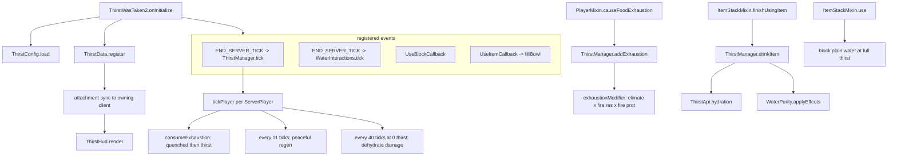

# ThirstWasTaken2

A Fabric fork of [Thirst Was Taken](https://github.com/ghen-git/Thirst-Mod) (originally Forge,
Minecraft 1.19.2) for **Minecraft 26.2 / Fabric Loader 0.19.3 / Java 25**. It adds a survival thirst
bar, drinking, and water purity to Minecraft and further extends the original mod. It started as a port
and has since diverged, so upstream is a reference, not a spec.

- Mod id and resource namespace: `thirstwastaken2`
- Java package: `com.thirstwastaken2`
- Upstream reference source is expected at `../Thirst-Mod` when comparing behaviour.
- Published on [Modrinth](https://modrinth.com/mod/thirst-was-taken-2).

## Build and run

```bash
./gradlew build
```

```bash
./gradlew runServer
```

```bash
./gradlew runClient
```

`runServer` is the fastest smoke test: it applies every mixin, loads the datapack registries, then
idles. A clean run prints
`ThirstWasTaken2 initialized for Minecraft 26.2` and no exceptions.

Gradle needs network access on the first run for `maven.modrinth` artifacts (Mod Menu, AppleSkin).
Once cached, `--offline` works — except that `clientCompileOnly` on Mod Menu must already be cached.

## Stack and constraints

- **Java 25**, **Minecraft 26.2**, **Fabric Loader 0.19.3**, **Fabric Loom 1.17-SNAPSHOT**.
- **Gradle Kotlin DSL** (`build.gradle.kts`, `settings.gradle.kts`) with version catalog in
  `gradle/libs.versions.toml`.
- **Source sets are split** (`loom.splitEnvironmentSourceSets()`). Anything that touches
  `net.minecraft.client` belongs in `src/client/java`, never in `src/main/java`.
- **Mixins live in `com.thirstwastaken2.mixin`**, are package-private, `abstract`, and prefix every
  injected member with `thirst$`. New mixins must be listed in `thirstwastaken2.mixins.json`.
- **Config is a plain POJO** serialized by Gson (`ThirstConfig`). Adding a field means: add it to the
  POJO, clamp it in `sanitize()`, and — if it is user-facing — add a widget in `ThirstConfigScreen`
  plus `en_us`/`vi_vn` keys.
- **Per-item lookups are cached** keyed by `Item` identity (`ThirstApi.CACHE`, `WaterPurity.INFO`).
  Never do registry-name string building or regex compilation on a per-call path; the tooltip
  renderer calls into both once per frame.
- **Optional mod integrations are soft**. Never add a hard dependency: gate on
  `FabricLoader.isModLoaded`, plus a marker-class probe when the integration extends a foreign class,
  and keep integration classes out of the load path otherwise.
- Player thirst state is an **immutable record** (`ThirstData`) stored as a Fabric attachment. Mutate
  by deriving a new record and calling `ThirstManager.set`; only write when the value actually
  changed, because every write costs a sync packet.

## Architecture in one pass

[ThirstWasTaken2.java](src/main/java/com/thirstwastaken2/ThirstWasTaken2.java) is the mod initializer:
it loads configuration (`ThirstConfig.load()`), registers the player attachment (`ThirstData.register()`),
registers items, commands, and server lifecycle/use callbacks.



### The player state model

`ThirstData` is a record — `thirst` (0-20), `quenched` (0-20), `exhaustion` (float), `enabled` — held
as a Fabric data attachment with `AttachmentSyncPredicate.targetOnly()`. Persistence uses `CODEC`;
the network uses `STREAM_CODEC`.

Every mutation returns a new record, so `ThirstManager.set` is the only write point and
`tickPlayer` only calls it when `!updated.equals(data)`. That keeps the sync to at most one packet
per player per tick.

Drain chain, mirroring vanilla hunger:
1. `Player.causeFoodExhaustion` → `ThirstManager.addExhaustion` (skipped while riding a mount).
2. Raw exhaustion is scaled by `exhaustionModifier`: climate (or the flat Nether value in dimensions
   where water evaporates), Fire Resistance, Fire Protection.
3. Once exhaustion passes 4, one point of `quenched` is spent; when quenched is empty, one point of
   `thirst` goes instead (unless Peaceful and depletion in Peaceful is off).
4. At 0 thirst, 1 damage every 40 ticks via `thirstwastaken2:dehydrate`.

## Where to look

Each area of the tree carries its own `AGENTS.md` with rules and conventions local to it:

| Task / Area | Location |
|---|---|
| Common code: init order, state invariants, caching rules | [src/main/java/com/thirstwastaken2/AGENTS.md](src/main/java/com/thirstwastaken2/AGENTS.md) |
| Vanilla behaviour hooks & fragile injections | [.../mixin/AGENTS.md](src/main/java/com/thirstwastaken2/mixin/AGENTS.md) |
| Water purity carriers, environmental sampling, cauldrons | [.../purity/AGENTS.md](src/main/java/com/thirstwastaken2/purity/AGENTS.md) |
| Loot injection & optional-integration rules | [.../compat/AGENTS.md](src/main/java/com/thirstwastaken2/compat/AGENTS.md) |
| Client HUD element rendering & config screen contract | [src/client/java/com/thirstwastaken2/client/AGENTS.md](src/client/java/com/thirstwastaken2/client/AGENTS.md) |
| Manifests, recipes, tags, models, fonts, lang keys | [src/main/resources/AGENTS.md](src/main/resources/AGENTS.md) |
| End-user documentation site (VitePress) | [docs/AGENTS.md](docs/AGENTS.md) |

### Layout

```
src/main/java/com/thirstwastaken2/      common (client + server)
  ThirstWasTaken2.java                  ModInitializer: wiring and event registration
  api/ThirstApi.java                   item -> {hydration, quenched}, memoised per Item
  command/ThirstCommands.java          /thirst query|set|enable
  config/ThirstConfig.java             config/thirstwastaken2.json, compiled patterns, generation counter
  damage/ThirstDamageTypes.java        thirstwastaken2:dehydrate damage source
  data/ThirstData.java                 immutable player state + attachment type
  data/ThirstManager.java              tick loop, exhaustion maths, drink-by-hand
  item/ThirstItems.java                bowl and waterskin registration + creative tab
  item/WaterskinItem.java              three-drink storage, consumption and inventory transfers
  purity/ThirstComponents.java         quality, salinity, purity and serving data components
  purity/WaterQuality.java             contamination score, salinity and tier thresholds
  purity/WaterPurity.java              environmental sampling, effects and container detection
  purity/WaterInteractions.java        bowl/waterskin filling, cauldron purity transfer
  tooltip/ThirstTooltip.java           separate thirst/quenched tooltip rows (thirstwastaken2:droplets font)
  compat/LootIntegration.java          structure chests + Piglin barter water
  mixin/                               vanilla hooks

src/client/java/com/thirstwastaken2/client/
  ThirstWasTaken2Client.java            HUD element registration
  ThirstHud.java                       thirst bar rendering
  config/ThirstConfigScreen.java       vanilla-styled options screen
  compat/AppleSkinIntegration.java     optional exhaustion-underlay setting bridge
  compat/ModMenuIntegration.java       modmenu entrypoint

src/main/resources/
  fabric.mod.json                      entrypoints (main, client, modmenu)
  thirstwastaken2.mixins.json           mixin registry
  assets/thirstwastaken2/               textures, models, lang (9 locales)
  assets/thirstwastaken2/font/          droplets.json: tooltip droplet glyphs (U+E000..U+E007)
  data/thirstwastaken2/                 recipes, damage type
  data/minecraft/tags/                 bypasses_armor
```

## Water purity

Purity is an integer 0-3 (dirty, slightly dirty, acceptable, purified).

| Carrier | Storage |
|---|---|
| Items | contamination, purity and salinity data components |
| Cauldrons | offset `purity` and boolean `salty` blockstate properties |
| Anything else | `ThirstConfig.defaultPurity` |

`WaterPurity.sampleAt(level, pos)` samples contamination and salinity only when water is collected or
drunk. Biome tags choose the baseline; temperature, altitude, flow and nearby mud or agriculture
apply small fixed modifiers. The result is stored on the container, so no environmental scan runs
on tick or tooltip paths.

`WaterPurity.INFO` caches, per `Item`, whether it counts as a water container and what static purity
it carries — this is how the optional Tough As Nails / Farmer's Delight / Farmer's Respite /
Brewin' and Chewin' / Collector's Reap support stays dependency-free.

## Mixins

| Mixin | Target | Purpose |
|---|---|---|
| `PlayerMixin` | `Player#causeFoodExhaustion`, `#canSprint` | mirror exhaustion, block sprinting at thirst <= 6 |
| `FoodDataMixin` | `FoodData#tick` (both `heal` call sites) | dehydration halts natural regen and refunds the food cost |
| `ItemStackMixin` | `#finishUsingItem`, `#addDetailsToTooltip` | grant hydration, render purity + thirst/quenched rows |
| `BottleItemMixin` | `BottleItem#use` | stamp purity on a bottle filled from a water block |
| `BucketItemMixin` | `BucketItem#use` | stamp purity on a bucket filled from a water block |
| `LayeredCauldronBlockMixin` | `#createBlockStateDefinition` | add purity and salinity properties |

## HUD

`ThirstWasTaken2Client` attaches `thirst_bar` after `VanillaHudElements.FOOD_BAR` and reserves 10px
of right-stack height. `ThirstHud.render` draws, in order:

1. when AppleSkin is present and its exhaustion-underlay option is enabled, a right-to-left dither
   strip from `appleskin_icons.png` at v=18, proportional to the client's exhaustion (0..4);
2. ten droplet slots from `thirst_icons.png` (41x9: empty, quarter, half, three quarter and full on an
   8px stride, so u = 0/8/16/24/32), shaken when quenched hits zero, exactly like the vanilla hunger
   bar. Frames share their transparent edge columns, which is why the stride is 8 and not 9. Each
   droplet holds two thirst points; the quarter and three-quarter frames come from
   `drainedFraction`, which spends the client's `exhaustion` (0..4) against the next point once
   quenched is empty. There is no setting for this, the five-frame drain is the only behaviour;
3. the quenched outline from `appleskin_icons.png` at v=0, u = 0/9/18/27 by quarter.

## Config

`config/thirstwastaken2.json` is a Gson dump of `ThirstConfig`. `ThirstConfig.generation()` increments
on every load or commit; `ThirstApi` watches it to drop its per-item cache.

The Mod Menu screen (`ThirstConfigScreen`) writes straight into the live instance through
`OptionInstance` listeners and calls `ThirstConfig.commit()` on close. Only the HUD section is
client-side — the rest is server-authoritative and takes effect in singleplayer or when edited on the
server.

## Optional integrations

| Integration | Gate | Notes |
|---|---|---|
| Mod Menu | `modmenu` entrypoint | class only loads if Mod Menu resolves it |
| Loot | always | Fabric `LootTableEvents.MODIFY` on 5 vanilla chests + Piglin bartering |
| Food mods | always | resolved by registry id in `ThirstConfig.drinks` / `foods`, no classes referenced |

## Porting rules of thumb

- Vanilla APIs the original relied on that no longer exist in 26.2:
  - `DimensionType#ultraWarm` → `EnvironmentAttributes.WATER_EVAPORATES`
  - `Biome#getDownfall` → no public equivalent; the port approximates with
    `Biome#hasPrecipitation()` (see `ThirstManager.climateModifier`)
  - Item NBT (`"Purity"` tag) → the `thirstwastaken2:water_purity` data component
  - Forge global loot modifiers → `LootTableEvents.MODIFY`
  - Forge GUI overlays → Fabric `HudElementRegistry`
- When behaviour differs from the original mod on purpose, say so in a comment at the divergence.

## Things that are deliberately not 1:1 with upstream

- Structure-chest water uses one Fabric loot pool per table instead of the original's
  Farmer's-Respite / Brewin'-and-Chewin' loot variants.
- The quenched overlay is drawn by this mod directly, always on, with no setting. When AppleSkin is
  installed, its exhaustion-underlay setting also controls a thirst exhaustion strip drawn from the
  `v = 18` row of `appleskin_icons.png`.
- Water quality is sampled from biome and a fixed local neighborhood only when water is collected.
  Salinity is separate from the four player-facing purity tiers.
