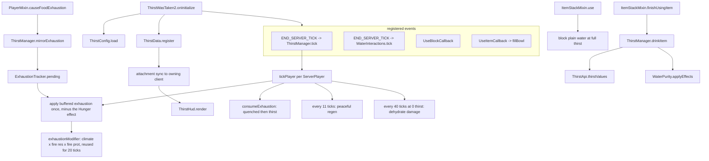

# ThirstWasTaken2

A Fabric fork of [Thirst Was Taken](https://github.com/ghen-git/Thirst-Mod) (originally Forge,
Minecraft 1.19.2) for **Minecraft 26.2, 26.1.x and 1.21.11** on **Fabric Loader 0.19.3**. It adds a
survival thirst bar, drinking, and water purity to Minecraft and further extends the original mod. It
started as a port and has since diverged, so upstream is a reference, not a spec.

- Mod id and resource namespace: `thirstwastaken2`
- Java package: `com.thirstwastaken2`
- Upstream reference source is expected at `../Thirst-Mod` when comparing behaviour.
- Published on [Modrinth](https://modrinth.com/mod/thirst-was-taken-2).

## Build and run

One source tree produces one jar per Minecraft version. Every version is a Gradle subproject named
after its entry in `settings.gradle.kts`: `26.2.x`, `26.1.x`, `1.21.11`.

Build every version and collect the jars in `build/libs/`:

```bash
./gradlew buildAndCollect
```

Build or run one version:

```bash
./gradlew ":26.1.x:build"
```

```bash
./gradlew ":26.1.x:runServer"
```

```bash
./gradlew ":26.1.x:runClient"
```

Run the automated in-game tests for one version:

```bash
./gradlew ":26.1.x:runGametest"
```

That is the check that actually proves behaviour. It replaces the dedicated server with Mojang's
GameTest runner, needs no display and no accepted EULA, finishes in a few seconds, and fails the
build on a failed assertion. CI runs it for every version. See
[src/gametest/java/AGENTS.md](src/gametest/java/AGENTS.md) before adding to it, including what it
deliberately does not cover.

Regenerate every datapack and asset JSON the mod ships:

```bash
./gradlew ":26.1.x:runDatagen"
```

Recipes, advancements, tags, the damage type and the item models are all written by `src/datagen`
into `src/main/generated/<minecraft version>/`, never edited by hand. `":<version>:checkDatagen"`
regenerates and then fails if the result differs from what is committed; CI runs it for every
version. See [src/datagen/java/AGENTS.md](src/datagen/java/AGENTS.md), including why the three
versions produce different bytes from one body of code.

Measure what the mod costs a server, in time and memory, without anyone joining:

```bash
./gradlew ":26.2.x:runBenchmark"
```

It starts the dedicated server with the dev tools, runs `/thirst benchmark` from the console once the
server is up, simulates 1 to 200 players plus every interaction, writes
`run/<version>/benchmark/latest.json` and stops the server again. `-Pbenchmark=quick`, `stress` or
`"players 500 1200"` changes the scale. The same command works typed into a `runServer` console. Read
[src/dev/java/AGENTS.md](src/dev/java/AGENTS.md) before comparing two reports.

`runServer` is the fastest smoke test: it applies every mixin, loads the datapack registries, then
idles. A clean run prints `ThirstWasTaken2 initialized for Minecraft <version>` and no exceptions.
Each version gets its own `run/<subproject>/` directory, because a world saved by one Minecraft
version is not readable by another.

Unqualified `./gradlew build` and `./gradlew runServer` still work; they act on the **active**
version, which is whichever one the source tree is currently checked out for (`26.2.x` by default).
Switch it with `./gradlew "Set active project to 1.21.11"` — that rewrites the versioned comments in
`src/` in place, which is what makes the IDE resolve against that version. Run
`./gradlew "Reset active project"` before committing.

Gradle needs network access on the first run for `maven.modrinth` artifacts (Mod Menu, AppleSkin).
Once cached, `--offline` works — except that the client compile-only dependencies must already be
cached.

## Stack and constraints

- **Minecraft 26.2, 26.1.x and 1.21.11**, **Fabric Loader 0.19.3**, **Fabric Loom 1.17**. 26.1+ runs
  on **Java 25**, 1.21.11 on **Java 21**; the build sets the toolchain and `--release` per version,
  so do not use a language feature newer than Java 21.
- **Multi-version via [Stonecutter](https://stonecutter.kikugie.dev)**. `settings.gradle.kts` lists
  the versions, `stonecutter.properties.toml` holds every per-version value (dependency versions,
  the `fabric.mod.json` range), `stonecutter.gradle.kts` is the controller, and `build.gradle.kts`
  is shared by all of them. `dev.kikugie.loom-back-compat` picks the Loom variant each version
  needs — 26.1 dropped obfuscation — and keeps `modImplementation` meaning the same thing on both.
- **Gradle Kotlin DSL**. There is no version catalog: per-version values cannot live in one, so
  they are all in `stonecutter.properties.toml`.
- **Source sets are split** (`loom.splitEnvironmentSourceSets()`). Anything that touches
  `net.minecraft.client` belongs in `src/client/java`, never in `src/main/java`.
- **`ThirstWasTaken2.DEV` separates development runs from published jars.** It is true under every
  Loom run task and false in the jar players install; `-Dthirstwastaken2.dev=true|false` overrides it.
  Dev-only tooling checks it before registering anything and lives in the `dev` source set, its own
  `thirstwastaken2-dev` mod like the gametests, which `main` and `client` never reference.
- **Mixins live in `com.thirstwastaken2.mixin`**, are package-private, `abstract`, and prefix every
  injected member with `thirst$`. New mixins must be listed in `thirstwastaken2.mixins.json`.
- **Config is a plain POJO** serialized by Gson (`ThirstConfig`). Adding a field means: add it to the
  POJO, clamp it in `sanitize()`, and — if it is user-facing — add a widget in `ThirstConfigScreen`
  plus `en_us`/`vi_vn` keys.
- **Per-item lookups are cached** keyed by `Item` identity (`ThirstApi.CACHE`, `WaterPurity.INFO`).
  Never do registry-name string building or regex compilation on a per-call path; the tooltip
  renderer calls into both once per frame.
- **Optional mod integrations are soft**. Never add a hard dependency: gate on
  `FabricLoader.isModLoaded`, plus a marker-class probe when the integration extends a foreign class,
  and keep integration classes out of the load path otherwise.
- Player thirst state is an **immutable record** (`ThirstData`) stored as a Fabric attachment. Mutate
  by deriving a new record and calling `ThirstManager.set`; only write when the value actually
  changed, because every write costs a sync packet.

## Supporting several Minecraft versions

The rule is that version differences stay in two places and nowhere else.

**`platform/`** — `com.thirstwastaken2.platform.Vanilla` for common code and
`com.thirstwastaken2.client.platform.ClientVanilla` for client code. Each is a thin wrapper over a
vanilla call whose shape moved between versions, with the same signature on every version. Callers
never learn which branch is live. Both have their own `AGENTS.md`.

**`mixin/`** — an `@Inject` signature tracks its target method and cannot be abstracted away, so a
mixin is allowed to fork. Its body still stays one line; the logic it calls lives in a normal class.

Everything else — `data/`, `purity/`, `config/`, `api/`, `item/` — should compile unchanged on every
version. A versioned comment appearing there means a seam is missing from `platform/`.

Version-specific branches are Stonecutter comments. The disabled branch is the commented one, and
which branch is commented is rewritten when the active version changes:

```java
//? if >=26.2 {
return minecraft.gui.hud.isHidden();
//?} else {
/*return minecraft.options.hideGui;
*///?}
```

A pure rename needs no branch at all. Register it once in `stonecutter.gradle.kts` and every file
follows:

```kotlin
replacements {
    string(current.parsed < "26.1") {
        replace("GuiGraphicsExtractor", "GuiGraphics")
    }
}
```

### Adding a Minecraft version

1. Add it to `stonecutter { create }` in `settings.gradle.kts` and add its matching block to
   `stonecutter.properties.toml` — Fabric API, Mod Menu, AppleSkin, Cloth Config, and the
   `mod.mc_compat` range. Mod Menu and Cloth Config resolve by version number; AppleSkin publishes
   one version number for both its Fabric and NeoForge uploads, so it is pinned by Modrinth version
   id or Maven resolves the wrong jar.
2. Add it to the matrix in `.github/workflows/build.yml`.
3. Run `./gradlew ":<version>:build"` and fix what the compiler reports, by extending `platform/`
   rather than by branching at the call site.
4. Smoke-test with `./gradlew ":<version>:runServer"`. The new `run/<version>/` directory needs its
   own `eula.txt`.

## Architecture in one pass

[ThirstWasTaken2.java](src/main/java/com/thirstwastaken2/ThirstWasTaken2.java) is the mod initializer:
it loads configuration (`ThirstConfig.load()`), registers the player attachment (`ThirstData.register()`),
registers items, commands, and server lifecycle/use callbacks.



### The player state model

`ThirstData` is a record — `thirst` (0-20), `quenched` (0-20), `exhaustion` (float), `enabled` — held
as a Fabric data attachment with `AttachmentSyncPredicate.targetOnly()`. Persistence uses `CODEC`;
the network uses `STREAM_CODEC`.

Every mutation returns a new record, so `ThirstManager.set` is the only write point and
`tickPlayer` only calls it when `!updated.equals(data)`. Vanilla exhaustion never writes on its own:
it is buffered on the player and applied by `tickPlayer`, which keeps the sync to at most one packet
per player per tick. Exhaustion is also only written once it crosses a quarter point
(`ThirstManager.SYNC_STEP`) or spends a point, with the remainder carried in
`ExhaustionTracker.unsynced`, so a moving player sends a few packets a second rather than twenty.

Drain chain, mirroring vanilla hunger:
1. `Player.causeFoodExhaustion` → `ThirstManager.mirrorExhaustion`, which adds the raw amount to the
   player's `ExhaustionTracker` (skipped while riding a mount). `tickPlayer` takes the total once per
   tick and subtracts what the Hunger effect charged.
2. Raw exhaustion is scaled by `exhaustionModifier`: climate (or the flat Nether value in dimensions
   where water evaporates), Fire Resistance, Fire Protection. The modifier is cached on the tracker
   for 20 ticks, or until the dimension or the config changes.
3. Once exhaustion passes 4, one point of `quenched` is spent; when quenched is empty, one point of
   `thirst` goes instead (unless Peaceful and depletion in Peaceful is off).
4. At 0 thirst, 1 damage every 40 ticks via `thirstwastaken2:dehydrate`.

## Where to look

Each area of the tree carries its own `AGENTS.md` with rules and conventions local to it:

| Task / Area | Location |
|---|---|
| Common code: init order, state invariants, caching rules, tooltip line tiers | [src/main/java/com/thirstwastaken2/AGENTS.md](src/main/java/com/thirstwastaken2/AGENTS.md) |
| Vanilla behaviour hooks & fragile injections | [.../mixin/AGENTS.md](src/main/java/com/thirstwastaken2/mixin/AGENTS.md) |
| Water purity carriers, environmental sampling, cauldrons | [.../purity/AGENTS.md](src/main/java/com/thirstwastaken2/purity/AGENTS.md) |
| Loot injection & optional-integration rules | [.../compat/AGENTS.md](src/main/java/com/thirstwastaken2/compat/AGENTS.md) |
| Minecraft version differences | [.../platform/AGENTS.md](src/main/java/com/thirstwastaken2/platform/AGENTS.md) |
| Automated in-game tests | [src/gametest/java/AGENTS.md](src/gametest/java/AGENTS.md) |
| Performance and memory benchmark, dev-only tooling | [src/dev/java/AGENTS.md](src/dev/java/AGENTS.md) |
| Client HUD element rendering & config screen contract | [src/client/java/com/thirstwastaken2/client/AGENTS.md](src/client/java/com/thirstwastaken2/client/AGENTS.md) |
| Manifests, textures, fonts, lang keys, and what the generated JSON means | [src/main/resources/AGENTS.md](src/main/resources/AGENTS.md) |
| The generators for every recipe, advancement, tag and model | [src/datagen/java/AGENTS.md](src/datagen/java/AGENTS.md) |
| End-user documentation site (VitePress) | [docs/AGENTS.md](docs/AGENTS.md) |

### Layout

```
src/main/java/com/thirstwastaken2/      common (client + server)
  ThirstWasTaken2.java                  ModInitializer: wiring and event registration
  advancement/ThirstAdvancements.java  awards the mod's advancements by id from the drinking code
  api/ThirstApi.java                   item -> {thirst, quenched}, memoised per Item
  command/ThirstCommands.java          /thirst query|set|enable
  config/ThirstConfig.java             config/thirstwastaken2.json, compiled patterns, generation counter
  damage/ThirstDamageTypes.java        thirstwastaken2:dehydrate damage source
  data/ThirstData.java                 immutable player state + attachment type
  data/ThirstManager.java              tick loop, exhaustion maths, drink-by-hand
  data/ExhaustionTracker.java          per-player buffered exhaustion and cached modifier, never saved
  data/HealthRegen.java                whether a dehydrated player may still regenerate
  item/ThirstItems.java                bowl and waterskin registration + creative tab
  item/WaterskinItem.java              three-drink storage, consumption and inventory transfers
  purity/ThirstComponents.java         purity, salinity and serving data components
  purity/WaterQuality.java             sealed Fresh(grade) | Salt
  purity/WaterPurity.java              environmental sampling, effects and container detection
  purity/WaterInteractions.java        bowl/waterskin filling, cauldron purity transfer
  purity/FillCapture.java              sample-then-stamp shared by the bottle and bucket mixins
  platform/Vanilla.java                vanilla calls that differ between Minecraft versions
  tooltip/ThirstTooltip.java           separate thirst/quenched tooltip rows (thirstwastaken2:droplets font)
  compat/LootIntegration.java          structure chests + Piglin barter water
  mixin/                               vanilla hooks

src/client/java/com/thirstwastaken2/client/
  ThirstWasTaken2Client.java            HUD element registration
  ThirstHud.java                       thirst bar rendering
  config/ThirstConfigScreen.java       vanilla-styled options screen
  platform/ClientVanilla.java          client vanilla calls that differ between versions
  compat/AppleSkinIntegration.java     optional exhaustion-underlay setting bridge
  compat/ModMenuIntegration.java       modmenu entrypoint

settings.gradle.kts                    the list of supported Minecraft versions
stonecutter.properties.toml            every per-version value
stonecutter.gradle.kts                 active version, swaps and renames
build.gradle.kts                       one build script, shared by every version

src/gametest/java/com/thirstwastaken2/gametest/
  TestFixtures.java                    water source, aimed player, readable assertions
  WaterFillingGameTest.java            bottle and bucket filling, resampling
  WaterEffectsGameTest.java            salt, dirty and purified water, drinking
  HealthRegenGameTest.java             dehydration halting regen, and the food refund
  WaterskinGameTest.java               mixing, capacity, emptying
  PurificationGameTest.java            which water the furnace recipes accept
  TooltipGameTest.java                 the lines the mod adds to a tooltip
  AdvancementGameTest.java             the advancements load, and unlock recipes that exist

src/dev/java/com/thirstwastaken2/dev/   dev-only tools mod, never packaged
  ThirstDev.java                       entrypoint: /thirst benchmark and the runBenchmark autorun
  benchmark/                           simulated players, tick and interaction scenarios, JSON report

src/datagen/java/com/thirstwastaken2/datagen/  datagen-only mod, never packaged
  ThirstDatagen.java                   entrypoint: every provider has to be listed here
  Thirst*Provider.java                 recipes, advancements, tags, damage type, models

src/main/resources/                     the hand-written assets only
  fabric.mod.json                      entrypoints (main, client, modmenu); templated per version
  thirstwastaken2.mixins.json           mixin registry
  assets/thirstwastaken2/               textures, lang (9 locales), icon.png
  assets/thirstwastaken2/font/          droplets.json: tooltip droplet glyphs (U+E000..U+E007)

src/main/generated/<minecraft version>/  written by src/datagen, a resource root of main
  assets/thirstwastaken2/               item models and model definitions
  data/thirstwastaken2/                 recipes, advancements, damage type, biome tag
  data/minecraft/tags/                 bypasses_armor
```

## Water quality

`WaterQuality` is a sealed interface with two cases: `Fresh(purity)`, graded 0-3 (dirty, murky,
clean, pure), and `Salt`. Salt water is not a grade, because cooking cannot improve it, one salty
serving spoils a whole batch and it never hydrates. Sealing it means every consumer - tooltip,
sickness, mixing, sprite - has to answer for salt water or fail to compile.

| Carrier | Storage |
|---|---|
| Items | `water_purity` for a grade, `water_salty` for sea water; salt water carries no grade at all |
| Cauldrons | one `purity` blockstate value: 0 unset, 1-4 the grades, 5 salt |
| Anything else | `ThirstConfig.defaultPurity` |

The cauldron deliberately uses one property rather than a grade plus a boolean: vanilla gives a
freshly placed block the first value of every property it has, and for a boolean that is `true`, so
a separate salinity flag makes every new cauldron read as sea water.

`WaterPurity.sampleAt(level, pos)` runs only when water is collected or drunk. Ocean and beach
biomes return `Salt` immediately; everything else is scored - biome tag baseline, then temperature,
altitude, flow and nearby mud or agriculture - and the score is graded on the spot. The score itself
is never stored, so nothing carries a number a player cannot see, and no environmental scan runs on
a tick or tooltip path.

`WaterPurity.INFO` caches, per `Item`, whether it counts as a water container and what static purity
it carries — this is how the optional Tough As Nails / Farmer's Delight / Farmer's Respite /
Brewin' and Chewin' / Collector's Reap support stays dependency-free.

## Mixins

| Mixin | Target | Purpose |
|---|---|---|
| `PlayerMixin` | `Player#causeFoodExhaustion`, `#canSprint` | mirror exhaustion, block sprinting at thirst <= 6 |
| `FoodDataMixin` | `FoodData#tick` (both `heal` call sites) | dehydration halts natural regen and refunds the food cost |
| `ItemStackMixin` | `#finishUsingItem`, `#addDetailsToTooltip` | restore thirst, render purity + thirst/quenched rows |
| `BottleItemMixin` | `BottleItem#use` | stamp purity on a bottle filled from a water block |
| `BucketItemMixin` | `BucketItem#use` | stamp purity on a bucket filled from a water block |
| `LayeredCauldronBlockMixin` | `#createBlockStateDefinition`, `#handlePrecipitation`, `#receiveStalactiteDrip` | add the stored-quality property; grade the water rain or a dripstone added |
| `CauldronBlockMixin` | `#handlePrecipitation`, `#receiveStalactiteDrip` | the same, for the empty cauldron those two turn into a water cauldron |

## HUD

`ThirstWasTaken2Client` attaches `thirst_bar` after `VanillaHudElements.FOOD_BAR` and reserves 10px
of right-stack height. `ThirstHud.render` draws, in order:

1. when AppleSkin is present and its exhaustion-underlay option is enabled, a right-to-left dither
   strip from `appleskin_icons.png` at v=18, proportional to the client's exhaustion (0..4);
2. ten droplet slots from `thirst_icons.png` (41x9: empty, quarter, half, three quarter and full on an
   8px stride, so u = 0/8/16/24/32), shaken when quenched hits zero, exactly like the vanilla hunger
   bar. Frames share their transparent edge columns, which is why the stride is 8 and not 9. Each
   droplet holds two thirst points; the quarter and three-quarter frames come from
   `drainedFraction`, which spends the client's `exhaustion` (0..4) against the next point once
   quenched is empty. There is no setting for this, the five-frame drain is the only behaviour;
3. the quenched outline from `appleskin_icons.png` at v=0, u = 0/9/18/27 by quarter.

## Config

`config/thirstwastaken2.json` is a Gson dump of `ThirstConfig`. `ThirstConfig.generation()` increments
on every load or commit; `ThirstApi` watches it to drop its per-item cache.

The Mod Menu screen (`ThirstConfigScreen`) writes straight into the live instance through
`OptionInstance` listeners and calls `ThirstConfig.commit()` on close. Only the HUD section is
client-side — the rest is server-authoritative and takes effect in singleplayer or when edited on the
server.

## Optional integrations

| Integration | Gate | Notes |
|---|---|---|
| Mod Menu | `modmenu` entrypoint | class only loads if Mod Menu resolves it |
| Loot | always | Fabric `LootTableEvents.MODIFY` on 5 vanilla chests + Piglin bartering |
| Food mods | always | resolved by registry id in `ThirstConfig.drinks` / `foods`, no classes referenced |

## Porting rules of thumb

- Vanilla APIs the original relied on that no longer exist in 26.2:
  - `DimensionType#ultraWarm` → `EnvironmentAttributes.WATER_EVAPORATES`
  - `Biome#getDownfall` → no public equivalent; the port approximates with
    `Biome#hasPrecipitation()` (see `ThirstManager.climateModifier`)
  - Item NBT (`"Purity"` tag) → the `thirstwastaken2:water_purity` data component
  - Forge global loot modifiers → `LootTableEvents.MODIFY`
  - Forge GUI overlays → Fabric `HudElementRegistry`
- When behaviour differs from the original mod on purpose, say so in a comment at the divergence.

## Things that are deliberately not 1:1 with upstream

- Structure-chest water uses one Fabric loot pool per table instead of the original's
  Farmer's-Respite / Brewin'-and-Chewin' loot variants.
- The quenched overlay is drawn by this mod directly, always on, with no setting. When AppleSkin is
  installed, its exhaustion-underlay setting also controls a thirst exhaustion strip drawn from the
  `v = 18` row of `appleskin_icons.png`.
- Water quality is sampled from biome and a fixed local neighborhood only when water is collected.
  Sea water is its own kind of water rather than a fifth grade, and shows one line and one sprite of
  its own instead of a grade it cannot have.
