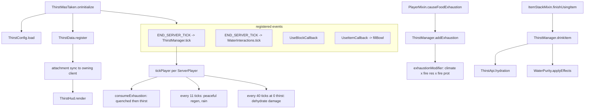

# Code map

How Thirst Was Taken (Fabric 26.2) is put together, and where to change what.

## Layout

```
src/main/java/com/thirstwastaken/      common (client + server)
  ThirstWasTaken.java                  ModInitializer: wiring and event registration
  api/ThirstApi.java                   item -> {hydration, quenched}, memoised per Item
  command/ThirstCommands.java          /thirst query|set|enable
  config/ThirstConfig.java             config/thirstwastaken.json, compiled patterns, generation counter
  damage/ThirstDamageTypes.java        thirstwastaken:dehydrate damage source
  data/ThirstData.java                 immutable player state + attachment type
  data/ThirstManager.java              tick loop, exhaustion maths, drink-by-hand
  item/ThirstItems.java                clay bowl, terracotta bowl, terracotta water bowl
  purity/ThirstComponents.java         thirstwastaken:water_purity data component
  purity/WaterPurity.java              purity lookup/apply, sickness table, container detection
  purity/WaterInteractions.java        bowl filling, cauldron purity transfer
  compat/LootIntegration.java          structure chests + Piglin barter water
  compat/createfly/                    optional Create Fly Sand Filter
  mixin/                               vanilla hooks

src/client/java/com/thirstwastaken/client/
  ThirstWasTakenClient.java            HUD element registration
  ThirstHud.java                       thirst bar rendering
  config/ThirstConfigScreen.java       vanilla-styled options screen
  compat/ModMenuIntegration.java       modmenu entrypoint

src/main/resources/
  fabric.mod.json                      entrypoints (main, client, modmenu)
  thirstwastaken.mixins.json           mixin registry
  assets/thirstwastaken/               textures, models, lang (9 locales)
  data/thirstwastaken/                 recipes, damage type, sand filter loot table
  data/minecraft/tags/                 bypasses_armor, mineable/pickaxe additions
```

## Runtime flow



## The player state model

`ThirstData` is a record — `thirst` (0-20), `quenched` (0-20), `exhaustion` (float), `enabled` — held
as a Fabric data attachment with `AttachmentSyncPredicate.targetOnly()`. Persistence uses `CODEC`;
the network uses `STREAM_CODEC`.

Every mutation returns a new record, so `ThirstManager.set` is the only write point and
`tickPlayer` only calls it when `!updated.equals(data)`. That keeps the sync to at most one packet
per player per tick.

Drain chain, mirroring vanilla hunger:

1. `Player.causeFoodExhaustion` → `ThirstManager.addExhaustion` (skipped while riding a mount).
2. Raw exhaustion is scaled by `exhaustionModifier`: climate (or the flat Nether value in dimensions
   where water evaporates), Fire Resistance, Fire Protection.
3. Once exhaustion passes 4, one point of `quenched` is spent; when quenched is empty, one point of
   `thirst` goes instead (unless Peaceful and depletion in Peaceful is off).
4. At 0 thirst, 1 damage every 40 ticks via `thirstwastaken:dehydrate`.

## Water purity

Purity is an integer 0-3 (dirty, slightly dirty, acceptable, purified).

| Carrier | Storage |
|---|---|
| Items | `thirstwastaken:water_purity` data component |
| Cauldrons | `purity` blockstate property, offset by 1 so 0 means "unset" |
| Create Fly fluids | the same data component on `FluidStack` |
| Anything else | `ThirstConfig.defaultPurity` |

`WaterPurity.at(level, pos)` resolves the purity of water in the world: block property first, then
altitude (above `mountainsY` or below `cavesY` is cleaner) plus a bonus for flowing water.

`WaterPurity.INFO` caches, per `Item`, whether it counts as a water container and what static purity
it carries — this is how the optional Tough As Nails / Farmer's Delight / Farmer's Respite /
Brewin' and Chewin' / Collector's Reap support stays dependency-free.

## Mixins

| Mixin | Target | Purpose |
|---|---|---|
| `PlayerMixin` | `Player#causeFoodExhaustion`, `#canSprint` | mirror exhaustion, block sprinting at thirst <= 6 |
| `FoodDataMixin` | `FoodData#tick` (both `heal` call sites) | dehydration halts natural regen and refunds the food cost |
| `ItemStackMixin` | `#finishUsingItem`, `#addDetailsToTooltip` | grant hydration, render purity/hydration tooltips |
| `BottleItemMixin` | `BottleItem#use` | stamp purity on a bottle filled from a water block |
| `BucketItemMixin` | `BucketItem#use` | stamp purity on a bucket filled from a water block |
| `LayeredCauldronBlockMixin` | `#createBlockStateDefinition` | add the `purity` blockstate property |

## HUD

`ThirstWasTakenClient` attaches `thirst_bar` after `VanillaHudElements.FOOD_BAR` and reserves 10px
of right-stack height. `ThirstHud.render` draws, in order:

1. the exhaustion dither strip from `appleskin_icons.png` at v=18 — **off by default**
   (`showExhaustionUnderlay`), because it is what produces the dotted look between droplets;
2. ten droplet slots from `thirst_icons.png` (25x9: empty at u=0, half at u=8, full at u=16), shaken
   when quenched hits zero, exactly like the vanilla hunger bar;
3. the quenched outline from `appleskin_icons.png` at v=0, u = 0/9/18/27 by quarter.

## Config

`config/thirstwastaken.json` is a Gson dump of `ThirstConfig`. `ThirstConfig.generation()` increments
on every load or commit; `ThirstApi` watches it to drop its per-item cache.

The Mod Menu screen (`ThirstConfigScreen`) writes straight into the live instance through
`OptionInstance` listeners and calls `ThirstConfig.commit()` on close. Only the HUD section is
client-side — the rest is server-authoritative and takes effect in singleplayer or when edited on the
server.

## Optional integrations

| Integration | Gate | Notes |
|---|---|---|
| Create Fly | `isModLoaded("create")` **and** `com.zurrtum.create...SmartBlockEntity` present | Sand Filter block, purifies pumped water by one step |
| Mod Menu | `modmenu` entrypoint | class only loads if Mod Menu resolves it |
| Loot | always | Fabric `LootTableEvents.MODIFY` on 5 vanilla chests + Piglin bartering |
| Food mods | always | resolved by registry id in `ThirstConfig.drinks` / `foods`, no classes referenced |
