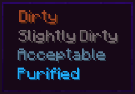

# Fabric port status

This document tracks the Minecraft 26.2 Fabric port of the original [Thirst Was Taken](https://github.com/ghen-git/Thirst-Mod) mod.

## Ported systems

| System | Status | Notes |
|---|---|---|
| Player thirst data | Complete | Persistent and synchronized with the owning client |
| Thirst exhaustion | Complete | Mirrors vanilla food exhaustion with a Nether multiplier |
| Quenched hydration | Complete | Absorbs exhaustion before the main thirst level drops |
| Dehydration damage | Complete | Uses the vanilla starvation damage source |
| Thirst HUD | Complete | Uses the Fabric HUD API and the Minecraft 26.2 render pipeline |
| Sprint restriction | Complete | Prevents sprinting at critically low thirst |
| Drink consumption | Complete | Supports potions, drinks, watery foods, and the water bowl |
| Water source drinking | Complete | Shift-right-click water with an empty hand |
| Rain drinking | Complete | Look upward while standing in rain |
| Commands | Complete | Includes level controls and per-player enable state |
| Custom bowls | Complete | Clay bowl, terracotta bowl, and terracotta water bowl |
| Languages | Complete | All original translations plus Vietnamese |
| Water purity | Complete | Four synchronized item-component levels, natural source purity, cauldron transfer, tooltips and sickness |
| Purification | Complete | Component-aware furnace and campfire recipes for bottles, bowls and buckets |
| Environmental modifiers | Complete | Biome temperature/humidity, Nether, Fire Resistance and Fire Protection modifiers |
| Natural regeneration | Complete | Dehydration can halt vanilla natural health regeneration |
| Config and item API | Complete | Editable JSON settings plus registry-ID hydration mappings and keyword fallback |
| Loot and bartering | Complete | Water loot in original structure tables and optional Piglin barters |
| Hydration overlays | Complete | Quenched/exhaustion HUD overlays and hydration/purity tooltips |
| Farmer's Delight | Complete | Supports the 26.2 Refabricated counterpart by stable registry IDs |
| Create | Complete | Optional Create Fly 26.2 Sand Filter with component-preserving fluid purification |

## Changes made for Fabric

- Replaced Forge capabilities with Fabric Data Attachments.
- Replaced Forge event subscribers with Fabric lifecycle and interaction events.
- Replaced Forge GUI overlays with the Fabric HUD Element API.
- Updated item registration and consumable components for Minecraft 26.2.
- Updated item model and recipe resource paths for Minecraft 26.2.
- Split common and client code into separate source sets.
- Changed the Java package to `com.thirstwastaken`.
- Changed the mod ID and resource namespace to `thirstwastaken`.
- Added Vietnamese and completed command translations for every bundled language.
- Added GitHub Actions builds and Dependabot updates.
- Added dedicated server startup validation.
- Replaced item NBT purity with a persistent, network-synchronized data component.
- Replaced Forge configs with `config/thirstwastaken.json`.
- Replaced Forge global loot modifiers with Fabric loot table events.
- Uses optional registry-ID integrations so supported food mods never become hard dependencies.

## Integrations held for a compatible 26.2 release

- Cold Sweat: no Fabric build exists; its project explicitly does not provide a Fabric port.
- Farmer's Respite: no Fabric 26.2 build exists. Its item IDs remain preconfigured for a future compatible port.
- Brewin' and Chewin': the Fabric/Fly ports currently stop before 26.2. Its item IDs remain preconfigured.
- Tough As Nails: Fabric currently stops at 26.1.2. Its drinks and purity mappings remain preconfigured.
- Supplementaries/Botania compatibility mixins: their old Forge fluid hooks have no matching 26.2 API in scope.
- Jade: Jade itself supports Fabric 26.2, but the old integration only inspected Forge/Create fluid NBT. Create Fly now carries purity as a synchronized component and the Sand Filter works without Jade; a dedicated Jade display provider can be added later without affecting gameplay.

## Original water purity reference

The original Forge mod uses four water purity levels. This image is retained as a reference for the future purity port.

  

## Verification

- `./gradlew build` succeeds with Java 25.
- The dedicated Fabric server reaches the ready state on Minecraft 26.2.
- The dedicated server also reaches the ready state with Create Fly 6.0.9-1 and loads its conditional Sand Filter recipe.
- GitHub Actions builds and uploads the release JAR.
