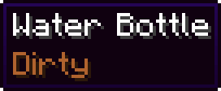

<div align="center">


[](https://modrinth.com/mod/thirst-was-taken-2)
[](https://www.curseforge.com/minecraft/mc-mods/thirst-was-taken-2)
[](https://n1ght3r.github.io/ThirstWasTaken2/)

A thirst bar, water purity and drinking for **Fabric** and **NeoForge**.

</div>

## Overview
* **Thirst and Quenched:** A thirst bar with a saturation-like reserve, drained faster by activity, heat and the Nether.
* **Water Quality:** Four fresh grades (Dirty, Murky, Clean, Pure) plus Salty sea water, sampled from the world when water is collected.
* **Purification:** Furnaces, campfires, Hanging Pots and in-hand boiling for the Copper Canteen and Iron Flask.
* **Containers:** Terracotta Bowl, Waterskin, Copper Canteen and Iron Flask.

Every mechanic is explained on the [documentation site](https://n1ght3r.github.io/ThirstWasTaken2/).

<div align="center">
<table>
  <tr>
    <td align="center"></td>
    <td align="center"></td>
  </tr>
</table>
</div>

## Requirements

| Minecraft | Java | Fabric Loader (min.) | Fabric API | NeoForge |
| :--- | :---: | :--- | :--- | :--- |
| 26.3 | 25 | 0.19.5 | 0.161.0+26.3 | 26.3.0.22-beta |
| 26.2 | 25 | 0.19.5 | 0.161.0+26.2 | 26.2.0.88 |
| 26.1 – 26.1.2 | 25 | 0.19.5 | 0.155.3+26.1.2 | 26.1.2.109 |
| 1.21.11 | 21 | 0.19.5 | 0.141.6+1.21.11 | 21.11.45 |
| 1.21.1 | 21 | 0.19.5 | 0.116.17+1.21.1 | 21.1.251 |
| 1.21 | 21 | 0.19.5 | 0.116.17+1.21.1 | – |

Versions listed are minimums. Install on the server **and** every client; NeoForge jars end in `-neoforge`.

## Compatibility
All integrations are soft dependencies: nothing is required, and nothing is loaded unless the mod is present.

| Mod | Fabric | NeoForge |
| :--- | :--- | :--- |
| [AppleSkin](https://modrinth.com/mod/appleskin), [Jade](https://modrinth.com/mod/jade), [Serene Seasons](https://modrinth.com/mod/serene-seasons) | every version | every version |
| [Farmer's Delight](https://n1ght3r.github.io/ThirstWasTaken2/docs/integrations/farmers-delight/) | every version (Refabricated) | 1.21.1 |
| [Create](https://n1ght3r.github.io/ThirstWasTaken2/docs/integrations/create) | 26.1.x, 26.2 (Create Fly) | 1.21.1 |
| [Sophisticated Backpacks / Storage](https://modrinth.com/mod/sophisticated-backpacks) | – | 1.21.1, 1.21.11, 26.1.x, 26.2 |
| [Kaleidoscope Cookery](https://n1ght3r.github.io/ThirstWasTaken2/docs/integrations/kaleidoscope-cookery) | every version (Refabricated) | 1.21.1 |
| [Rustic Delight](https://n1ght3r.github.io/ThirstWasTaken2/docs/integrations/farmers-delight/rustic-delight) | every version | 1.21.1 |
| [Supplementaries](https://n1ght3r.github.io/ThirstWasTaken2/docs/integrations/supplementaries), [Brewin' and Chewin'](https://n1ght3r.github.io/ThirstWasTaken2/docs/integrations/farmers-delight/brewin-and-chewin), [Ocean's Delight](https://n1ght3r.github.io/ThirstWasTaken2/docs/integrations/farmers-delight/oceans-delight) | 1.21.1 | 1.21.1 |
| [Cold Sweat](https://n1ght3r.github.io/ThirstWasTaken2/docs/integrations/cold-sweat), [Cultural Delights](https://n1ght3r.github.io/ThirstWasTaken2/docs/integrations/farmers-delight/cultural-delights), [Fruits Delight](https://n1ght3r.github.io/ThirstWasTaken2/docs/integrations/farmers-delight/fruits-delight), [Expanded Delight](https://n1ght3r.github.io/ThirstWasTaken2/docs/integrations/farmers-delight/expanded-delight) | – | 1.21.1 |

Tested versions of each mod are in the [installation guide](https://n1ght3r.github.io/ThirstWasTaken2/docs/installation#compatible-mods).

## Configuration
* **File:** `config/thirstwastaken2.json`, or in game through [Mod Menu](https://modrinth.com/mod/modmenu) (Fabric) or the Mods list (NeoForge).
* **Scope:** Gameplay settings are server-side and synced; HUD settings are per client.
* **Reference:** Every key is documented in the [configuration page](https://n1ght3r.github.io/ThirstWasTaken2/docs/configuration).

## Commands
Require permission level 2.

| Command | Description |
| :--- | :--- |
| `/thirst query <player>` | Show thirst and quenched values |
| `/thirst set <players> <thirst> <quenched>` | Set thirst and quenched values |
| `/thirst enable <players> <true\|false>` | Enable or disable thirst |

## For Developers

**Data Packs:** Give any item a thirst value with one JSON file in `data/<namespace>/thirstwastaken2/drinks/`, no dependency needed:

```json
{
  "values": {
    "mymod:lemonade": { "thirst": 6, "quenched": 8 },
    "mymod:iced_tea": { "thirst": 8, "quenched": 12 }
  }
}
```

**Java API:** `com.thirstwastaken2.api` reads and changes thirst, hooks drinking and reads water purity, with one signature on every loader and version:

```java
// Salty snacks restore no thirst.
ThirstEvents.DRINK.register((player, stack, drink) -> {
    if (stack.is(MyItems.SALTY_SNACK)) drink.cancel();
});

// Give a player a bottle of Pure water.
player.addItem(ThirstApi.waterBottle(ThirstApi.maxPurity()));
```

See the [data pack](https://n1ght3r.github.io/ThirstWasTaken2/docs/developers/data-packs) and [Java API](https://n1ght3r.github.io/ThirstWasTaken2/docs/developers/java-api) guides.

## Building
One source tree built for every version with [Stonecutter](https://stonecutter.kikugie.dev). Gradle downloads the Java version each node needs.

```bash
git clone https://github.com/n1ght3r/ThirstWasTaken2.git
cd ThirstWasTaken2
./gradlew buildAndCollect
```

Jars land in `build/libs/`, one per version and loader. Nodes are `26.3.x`, `26.2.x`, `26.1.x`, `1.21.11`, `1.21.1`, and the same with `-neoforge`:

| Task | Command |
| :--- | :--- |
| Build one node | `./gradlew ":26.3.x:build"` |
| Dev client / server | `./gradlew ":26.3.x:runClient"` / `":26.3.x:runServer"` |
| In-game tests | `./gradlew ":26.3.x:runGametest"` |
| Regenerate data | `./gradlew ":26.3.x:runDatagen"` (Fabric nodes) |

Contributions are welcome, see [CONTRIBUTING.md](CONTRIBUTING.md). Nine languages are included; translation PRs are welcome too.

## Credits
* Based on [Thirst Was Taken](https://github.com/ghen-git/Thirst-Mod) by [ghen](https://github.com/ghen-git), under the MIT License.
* Hanging Pot models adapted from [Dehydration](https://github.com/Globox1997/Dehydration) by [Globox1997](https://github.com/Globox1997), under the GPL-3.0.
* Licensed under the [GPL-3.0](LICENSE). Full credits in [CREDITS.md](CREDITS.md).
