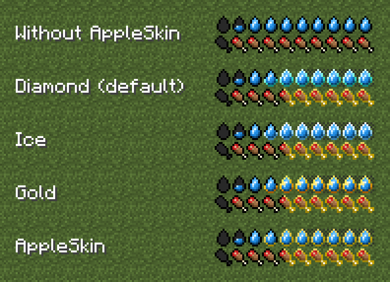
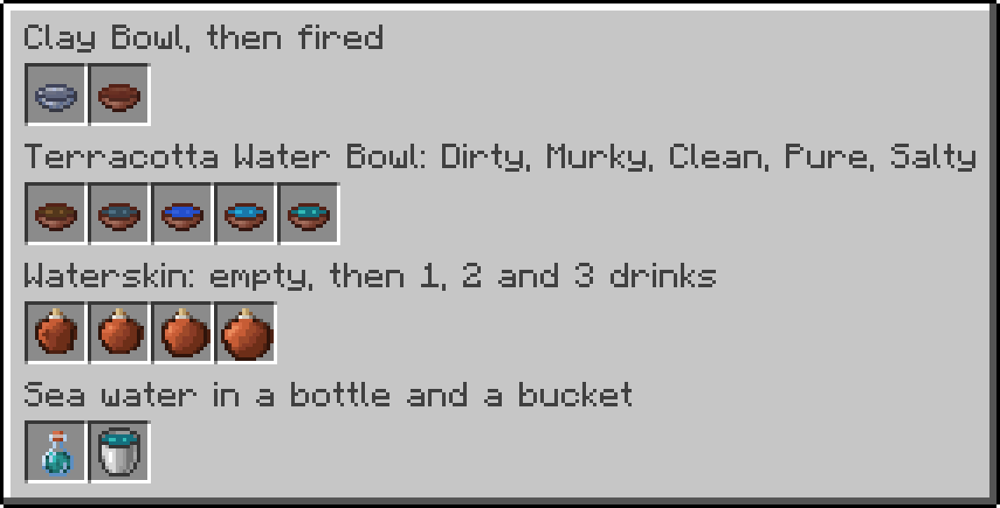
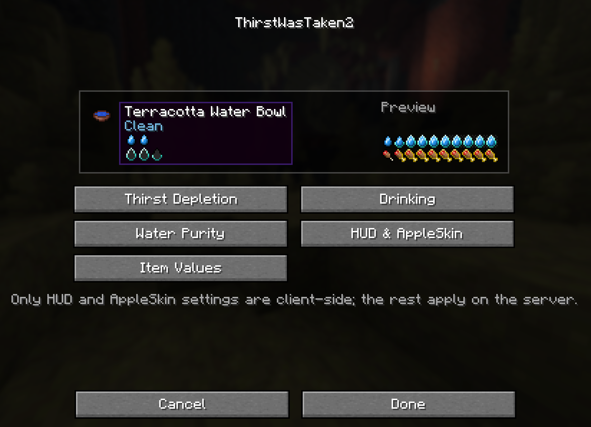
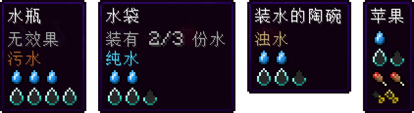

<div align="center">


[](https://modrinth.com/mod/thirst-was-taken-2)
[](https://nighterezi.github.io/ThirstWasTaken2/)
[](https://discord.gg/YwD9Xv7Beu)

<br>

Fabric port of the original [Thirst Was Taken](https://modrinth.com/mod/thirst-was-taken) by [**ghen**](https://github.com/ghen-git). It adds a survival thirst bar, drinking, and water purity to Minecraft. Available in 9 languages, with built-in support for AppleSkin, Jade, Farmer's Delight, Mod Menu and drinks from other mods.

</div>

## Features

- Thirst, quenched and exhaustion
- Faster thirst loss from activity, hot biomes and the Nether
- Damage, disabled sprinting and disabled natural healing when dehydrated
- Drinking from water sources, potions, foods, water bowls and a reusable waterskin
- A reusable three-drink waterskin that preserves and mixes water purity
- Four water-purity levels with negative effects from unsafe water
- Water purification using furnaces and campfires
- Purity information in item tooltips
- Optional AppleSkin support: a quenched outline in four colours, thirst and quenched droplet rows in
  item tooltips, and the exhaustion underlay on the thirst bar
- Optional Jade support: the grade of the water under the crosshair
- Optional Farmer's Delight support: thirst values for its drinks and meals, water purification in the
  Cooking Pot, and no thirst drain under Nourishment
- Optional Create Fly support on Minecraft 26.1.2 and 26.2: the Sand Filter, and water that keeps its grade
  through pipes, pumps and spouts
- Configurable HUD position and gameplay settings
- Mod Menu configuration screen
- `/thirst` commands for server administrators

| Thirst bar | With AppleSkin |
|---|---|
|  |  |

| Water purity | Items |
|---|---|
|  |  |

| Config screen | Simplified Chinese |
|---|---|
|  |  |

## Requirements

There is one download per Minecraft version, named after it, for example
`ThirstWasTaken2-1.0.4+1.21.11.jar`. The `+1.21.1` download also runs on Minecraft 1.21.

| Component | Minecraft 26.2 | Minecraft 26.1.x | Minecraft 1.21.11 | Minecraft 1.21.1 |
|---|---|---|---|---|
| Java | 25 | 25 | 21 | 21 |
| Fabric Loader | 0.19.3 or newer | 0.19.3 or newer | 0.19.3 or newer | 0.19.3 or newer |
| Fabric API | 0.160.0+26.2 | 0.155.3+26.1.2 | 0.141.6+1.21.11 | 0.116.17+1.21.1 |
| Mod Menu | Optional, 20.0.1 tested | Optional, 18.0.0 tested | Optional, 17.0.0 tested | Optional, 11.0.4 tested |
| AppleSkin | Optional, 3.0.10+mc26.2 tested | Optional, 3.0.10+mc26.1.2 tested | Optional, 3.0.8+mc1.21.11 tested | Optional, 3.0.6+mc1.21 tested |
| Cloth Config | Optional, needed for AppleSkin's Mod Menu screen | Same | Same | Same |
| Jade | Optional, 26.2.11 | Optional, 26.1.11 | Optional, 21.1.6 | Optional, 15.10.6 |
| Farmer's Delight Refabricated | Optional, 26.2-3.6.21 | Optional, 26.1-3.6.21 | Optional, 1.21.11-3.6.16 | Optional, 1.21.1-3.3.6 |
| Create Fly | Optional, 26.2-rc-2-6.0.9-1 | Optional, 26.1.2-6.0.9-4 | Not supported | Not supported |

Download ThirstWasTaken2 from [Modrinth](https://modrinth.com/mod/thirst-was-taken-2) and install it along with Fabric API on both the client and server. Put the downloaded JAR in the
`mods` folder.

See the [installation guide](https://nighterezi.github.io/ThirstWasTaken2/docs/installation) for
more details.

## Configuration

Settings can be changed through Mod Menu or in `config/thirstwastaken2.json`.

Gameplay settings are controlled by the server. HUD settings are controlled by each client.

## Commands

| Command | Description |
|---|---|
| `/thirst query <player>` | Show thirst and quenched values |
| `/thirst set <players> <thirst> <quenched>` | Set thirst and quenched values |
| `/thirst enable <players> <true/false>` | Enable or disable thirst |

These commands require game master permission.

## Known limitations

- The Create Fly Sand Filter is only available on Minecraft 26.1.2 and 26.2, and Builder's Tea does not restore
  thirst yet.
- On Minecraft 1.21 and 1.21.1, sea water in bottles and buckets looks like ordinary water (its tooltip
  still reads Salty), and the droplets in item tooltips have a shadow.
- Cold Sweat, Farmer's Respite, Brewin' and Chewin', Tough As Nails, Supplementaries and Botania do
  not yet have compatible Fabric releases on Minecraft 26.x. Their items are already configured and
  start working as soon as those mods are available.

## Languages

English, French, Japanese, Korean, Polish, Russian, Vietnamese, Simplified Chinese and Traditional
Chinese are included.

## Build

```bash
./gradlew buildAndCollect
```

One JAR per supported Minecraft version is created in `build/libs/`. To build a single version, use
`./gradlew ":1.21.11:build"`.

## License

ThirstWasTaken2 is available under the [MIT License](LICENSE).
