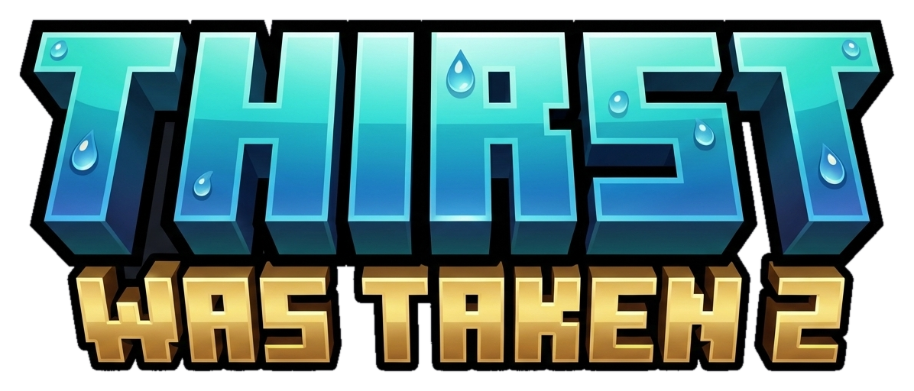

<p align="center">
  
</p>

<h1 align="center">Thirst Was Taken Fabric</h1>

<p align="center">
  A lightweight thirst and hydration mod for Minecraft 26.2 on Fabric.
</p>

<p align="center">
  <a href="https://github.com/Nighterezi/ThirstWasTakenFabric/actions/workflows/build.yml"></a>
  
  
  <a href="LICENSE"></a>
</p>

> A Fabric port of the original [Thirst Was Taken](https://modrinth.com/mod/thirst-was-taken) by ghen.

Thirst Was Taken adds a survival thirst system designed to fit naturally into modpacks. Movement and other exhausting activities consume hydration, drinks and watery foods restore it, and severe dehydration can slow or damage the player.

## Highlights

- Persistent thirst, quenched hydration, and exhaustion data
- A client-synchronized thirst HUD
- Dehydration damage and sprint prevention at low hydration
- Hydration from potions, drinks, watery foods, and water bowls
- Shift-right-click a water source with an empty hand to drink
- Rain drinking when looking upward
- Extra dehydration in the Nether
- Administrator commands for setting or enabling thirst
- Client language detection with 9 bundled translations

## Install

Install the following on both the client and server:

- Minecraft Java Edition 26.2
- Fabric Loader 0.19.3 or newer
- Fabric API 0.156.0+26.2 or another compatible 26.2 release
- Java 25

Download the JAR from a successful [GitHub Actions build](https://github.com/Nighterezi/ThirstWasTakenFabric/actions/workflows/build.yml), then place it in the `mods` folder.

## Commands

| Command | Action |
|---|---|
| `/thirst set <players> <thirst> <quenched>` | Set thirst and quenched levels |
| `/thirst enable <players> <true|false>` | Enable or disable thirst ticking |

These commands require game master permission.

## Languages

Minecraft automatically uses the language selected by each client. No server-side language option is needed.

- English
- French
- Japanese
- Korean
- Polish
- Russian
- Vietnamese
- Simplified Chinese
- Traditional Chinese

Translation files are located in `src/main/resources/assets/thirstwastaken/lang/`.

## Build

```bash
./gradlew build
```

The ready-to-use JAR is created in `build/libs/`.

## Credits

- Original author: [ghen](https://github.com/ghen-git)
- Original source: [ghen-git/Thirst-Mod](https://github.com/ghen-git/Thirst-Mod)
- Fabric port: [Nighter](https://github.com/Nighterezi)
- Fabric port source: [Nighterezi/ThirstWasTakenFabric](https://github.com/Nighterezi/ThirstWasTakenFabric)

The banner, icon, translations, and water purity reference image originate from the original project.

## License

[MIT](LICENSE). See the original project and its contributors in the credits above.
