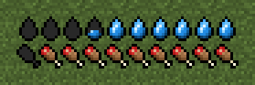
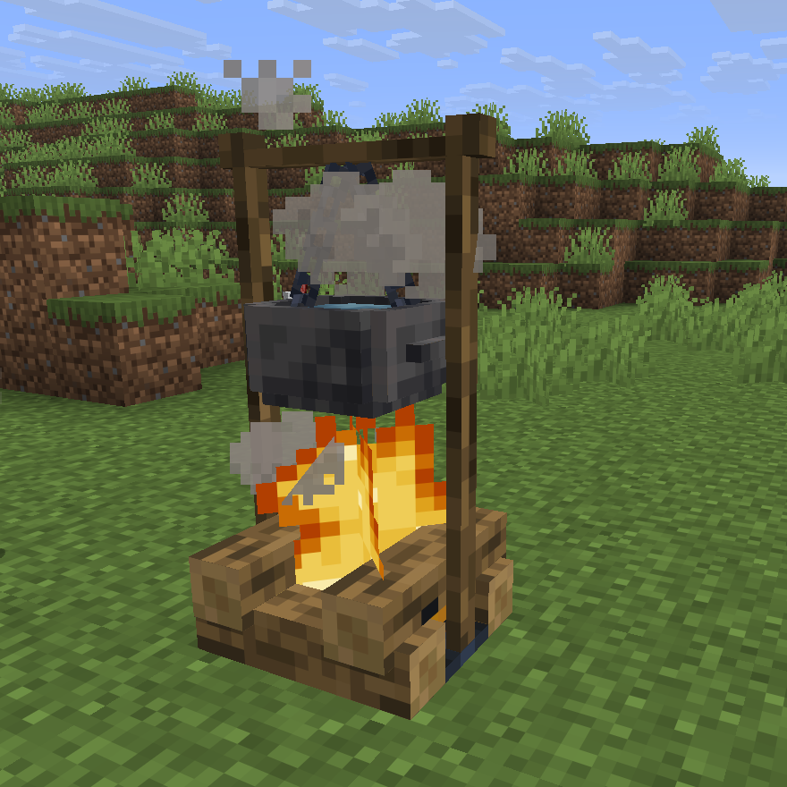

<div align="center">


[](https://modrinth.com/mod/thirst-was-taken-2)
[](https://www.curseforge.com/minecraft/mc-mods/thirst-was-taken-2)
[](https://nighterezi.github.io/ThirstWasTaken2/)

</div>

## Features

- A thirst bar with a quenched reserve, drained faster by activity, heat and the Nether.
- Four water grades plus salty sea water. Unsafe water can make players sick.
- Clean water by boiling it in a furnace, on a campfire, or in a Copper or Iron Hanging Pot.
- Terracotta bowls and a three-drink waterskin for early game drinking.
- Optional support for AppleSkin, Jade, Farmer's Delight, Create Fly and Create.

| Thirst bar | Water grades |
|---|---|
|  |  |

| Iron Hanging Pot | Config screen |
|---|---|
|  |  |

Every feature is explained on the [documentation site](https://nighterezi.github.io/ThirstWasTaken2/).

## Download

Download the mod from [Modrinth](https://modrinth.com/mod/thirst-was-taken-2). It is also on
[CurseForge](https://www.curseforge.com/minecraft/mc-mods/thirst-was-taken-2).

Put the jar in the `mods` folder of the server and of every client. NeoForge files end in
`-neoforge`.

## Requirements

### Fabric

| Minecraft | Fabric Loader | Fabric API | Java |
|---|---|---|---|
| 26.2 | 0.19.5 or newer | 0.161.0+26.2 or newer | 25 |
| 26.1, 26.1.1, 26.1.2 | 0.19.5 or newer | 0.155.3+26.1.2 or newer | 25 |
| 1.21.11 | 0.19.5 or newer | 0.141.6+1.21.11 or newer | 21 |
| 1.21, 1.21.1 | 0.19.5 or newer | 0.116.17+1.21.1 or newer | 21 |

### NeoForge

| Minecraft | NeoForge | Java |
|---|---|---|
| 26.2 | 26.2.0.88 or newer | 25 |
| 26.1, 26.1.1, 26.1.2 | 26.1.2.109 or newer | 25 |
| 1.21.11 | 21.11.45 or newer | 21 |
| 1.21.1 | 21.1.251 or newer | 21 |

Optional mods and their versions are listed in the
[installation guide](https://nighterezi.github.io/ThirstWasTaken2/docs/installation#compatible-mods).

## Configuration

Settings can be changed in game, through Mod Menu on Fabric or the Mods list on NeoForge, or in
`config/thirstwastaken2.json`.

Gameplay settings are controlled by the server. HUD settings are controlled by each client.

## Commands

| Command | Description |
|---|---|
| `/thirst query <player>` | Show thirst and quenched values |
| `/thirst set <players> <thirst> <quenched>` | Set thirst and quenched values |
| `/thirst enable <players> <true/false>` | Enable or disable thirst |

These commands require game master permission.

## Languages

English, French, Japanese, Korean, Polish, Russian, Vietnamese, Simplified Chinese and Traditional
Chinese are included.

## Build

The 26.x versions need Java 25 and the 1.21.x versions need Java 21. Gradle downloads a missing
Java version by itself.

```bash
git clone https://github.com/Nighterezi/ThirstWasTaken2.git
cd ThirstWasTaken2
./gradlew buildAndCollect
```

One jar per Minecraft version and loader is created in `build/libs/`.

Each version has its own project name: `26.2.x`, `26.1.x`, `1.21.11` and `1.21.1` for Fabric, and
the same names ending in `-neoforge` for NeoForge. Use it to work on a single version:

| Task | Command |
|---|---|
| Build | `./gradlew ":26.2.x:build"` |
| Start a test client | `./gradlew ":26.2.x:runClient"` |
| Start a test server | `./gradlew ":26.2.x:runServer"` |
| Run the in-game tests | `./gradlew ":26.2.x:runGametest"` |

To contribute, see [CONTRIBUTING.md](CONTRIBUTING.md).

## License

ThirstWasTaken2 is available under the [GNU General Public License v3.0](LICENSE). See
[CREDITS.md](CREDITS.md) for credits.
